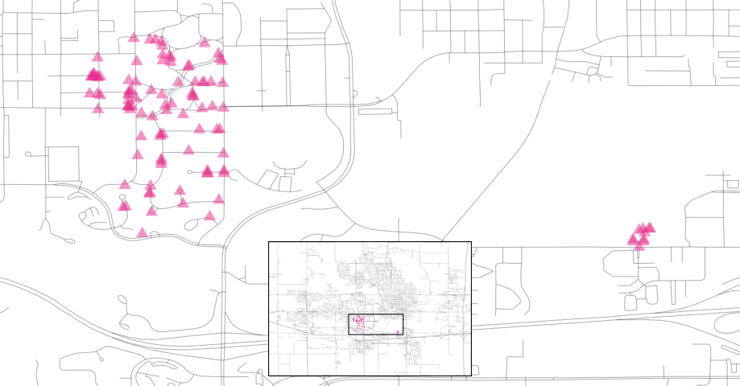

# (PART\*) Modeling Basics {-} 

# The Ames Housing Data {#ames}

In this chapter, we'll introduce the Ames housing data set [@ames], which we will use in modeling examples throughout this book. Exploratory data analysis, like what we walk through in this chapter, is an important first step in building a reliable model. The data set contains information on r format(nrow(ames), big.mark = ",") properties in Ames, Iowa, including columns related to: 

 * house characteristics (bedrooms, garage, fireplace, pool, porch, etc.)
 * location (neighborhood)
 * lot information (zoning, shape, size, etc.)
 * ratings of condition and quality
 * sale price

:::rmdnote
Our modeling goal is to predict the sale price of a house based on other information we have, such as its characteristics and location. 
:::

The raw housing data are provided in @ames, but in our analyses in this book, we use a transformed version available in the r pkg(modeldata) package. This version has several changes and improvements to the data.^[For a complete account of the differences, see <https://github.com/topepo/AmesHousing/blob/master/R/make_ames.R>.] For example, the longitude and latitude values have been determined for each property. Also, some columns were modified to be more analysis ready. For example: 

 * In the raw data, if a house did not have a particular feature, it was implicitly encoded as missing. For example, 2,732 properties did not have an alleyway. Instead of leaving these as missing, they were relabeled in the transformed version to indicate that no alley was available.

 * The categorical predictors were converted to R's factor data type. While both the tidyverse and base R have moved away from importing data as factors by default, this data type is a better approach for storing qualitative data for modeling than simple strings.  
 * We removed a set of quality descriptors for each house since they are more like outcomes than predictors.

To load the data: 


```r
library(modeldata) # This is also loaded by the tidymodels package
data(ames)

# or, in one line:
data(ames, package = "modeldata")

dim(ames)
```

```
## [1] 2930   74
```

```r
str(ames)
```

```
## tibble [2,930 × 74] (S3: tbl_df/tbl/data.frame)
##  $ MS_SubClass       : Factor w/ 16 levels "One_Story_1946_and_Newer_All_Styles",..: 1 1 1 1 6 6 12 12 12 6 ...
##  $ MS_Zoning         : Factor w/ 7 levels "Floating_Village_Residential",..: 3 2 3 3 3 3 3 3 3 3 ...
##  $ Lot_Frontage      : num [1:2930] 141 80 81 93 74 78 41 43 39 60 ...
##  $ Lot_Area          : int [1:2930] 31770 11622 14267 11160 13830 9978 4920 5005 5389 7500 ...
##  $ Street            : Factor w/ 2 levels "Grvl","Pave": 2 2 2 2 2 2 2 2 2 2 ...
##  $ Alley             : Factor w/ 3 levels "Gravel","No_Alley_Access",..: 2 2 2 2 2 2 2 2 2 2 ...
##  $ Lot_Shape         : Factor w/ 4 levels "Regular","Slightly_Irregular",..: 2 1 2 1 2 2 1 2 2 1 ...
##  $ Land_Contour      : Factor w/ 4 levels "Bnk","HLS","Low",..: 4 4 4 4 4 4 4 2 4 4 ...
##  $ Utilities         : Factor w/ 3 levels "AllPub","NoSeWa",..: 1 1 1 1 1 1 1 1 1 1 ...
##  $ Lot_Config        : Factor w/ 5 levels "Corner","CulDSac",..: 1 5 1 1 5 5 5 5 5 5 ...
##  $ Land_Slope        : Factor w/ 3 levels "Gtl","Mod","Sev": 1 1 1 1 1 1 1 1 1 1 ...
##  $ Neighborhood      : Factor w/ 29 levels "North_Ames","College_Creek",..: 1 1 1 1 7 7 17 17 17 7 ...
##  $ Condition_1       : Factor w/ 9 levels "Artery","Feedr",..: 3 2 3 3 3 3 3 3 3 3 ...
##  $ Condition_2       : Factor w/ 8 levels "Artery","Feedr",..: 3 3 3 3 3 3 3 3 3 3 ...
##  $ Bldg_Type         : Factor w/ 5 levels "OneFam","TwoFmCon",..: 1 1 1 1 1 1 5 5 5 1 ...
##  $ House_Style       : Factor w/ 8 levels "One_and_Half_Fin",..: 3 3 3 3 8 8 3 3 3 8 ...
##  $ Overall_Cond      : Factor w/ 10 levels "Very_Poor","Poor",..: 5 6 6 5 5 6 5 5 5 5 ...
##  $ Year_Built        : int [1:2930] 1960 1961 1958 1968 1997 1998 2001 1992 1995 1999 ...
##  $ Year_Remod_Add    : int [1:2930] 1960 1961 1958 1968 1998 1998 2001 1992 1996 1999 ...
##  $ Roof_Style        : Factor w/ 6 levels "Flat","Gable",..: 4 2 4 4 2 2 2 2 2 2 ...
##  $ Roof_Matl         : Factor w/ 8 levels "ClyTile","CompShg",..: 2 2 2 2 2 2 2 2 2 2 ...
##  $ Exterior_1st      : Factor w/ 16 levels "AsbShng","AsphShn",..: 4 14 15 4 14 14 6 7 6 14 ...
##  $ Exterior_2nd      : Factor w/ 17 levels "AsbShng","AsphShn",..: 11 15 16 4 15 15 6 7 6 15 ...
##  $ Mas_Vnr_Type      : Factor w/ 5 levels "BrkCmn","BrkFace",..: 5 4 2 4 4 2 4 4 4 4 ...
##  $ Mas_Vnr_Area      : num [1:2930] 112 0 108 0 0 20 0 0 0 0 ...
##  $ Exter_Cond        : Factor w/ 5 levels "Excellent","Fair",..: 5 5 5 5 5 5 5 5 5 5 ...
##  $ Foundation        : Factor w/ 6 levels "BrkTil","CBlock",..: 2 2 2 2 3 3 3 3 3 3 ...
##  $ Bsmt_Cond         : Factor w/ 6 levels "Excellent","Fair",..: 3 6 6 6 6 6 6 6 6 6 ...
##  $ Bsmt_Exposure     : Factor w/ 5 levels "Av","Gd","Mn",..: 2 4 4 4 4 4 3 4 4 4 ...
##  $ BsmtFin_Type_1    : Factor w/ 7 levels "ALQ","BLQ","GLQ",..: 2 6 1 1 3 3 3 1 3 7 ...
##  $ BsmtFin_SF_1      : num [1:2930] 2 6 1 1 3 3 3 1 3 7 ...
##  $ BsmtFin_Type_2    : Factor w/ 7 levels "ALQ","BLQ","GLQ",..: 7 4 7 7 7 7 7 7 7 7 ...
##  $ BsmtFin_SF_2      : num [1:2930] 0 144 0 0 0 0 0 0 0 0 ...
##  $ Bsmt_Unf_SF       : num [1:2930] 441 270 406 1045 137 ...
##  $ Total_Bsmt_SF     : num [1:2930] 1080 882 1329 2110 928 ...
##  $ Heating           : Factor w/ 6 levels "Floor","GasA",..: 2 2 2 2 2 2 2 2 2 2 ...
##  $ Heating_QC        : Factor w/ 5 levels "Excellent","Fair",..: 2 5 5 1 3 1 1 1 1 3 ...
##  $ Central_Air       : Factor w/ 2 levels "N","Y": 2 2 2 2 2 2 2 2 2 2 ...
##  $ Electrical        : Factor w/ 6 levels "FuseA","FuseF",..: 5 5 5 5 5 5 5 5 5 5 ...
##  $ First_Flr_SF      : int [1:2930] 1656 896 1329 2110 928 926 1338 1280 1616 1028 ...
##  $ Second_Flr_SF     : int [1:2930] 0 0 0 0 701 678 0 0 0 776 ...
##  $ Gr_Liv_Area       : int [1:2930] 1656 896 1329 2110 1629 1604 1338 1280 1616 1804 ...
##  $ Bsmt_Full_Bath    : num [1:2930] 1 0 0 1 0 0 1 0 1 0 ...
##  $ Bsmt_Half_Bath    : num [1:2930] 0 0 0 0 0 0 0 0 0 0 ...
##  $ Full_Bath         : int [1:2930] 1 1 1 2 2 2 2 2 2 2 ...
##  $ Half_Bath         : int [1:2930] 0 0 1 1 1 1 0 0 0 1 ...
##  $ Bedroom_AbvGr     : int [1:2930] 3 2 3 3 3 3 2 2 2 3 ...
##  $ Kitchen_AbvGr     : int [1:2930] 1 1 1 1 1 1 1 1 1 1 ...
##  $ TotRms_AbvGrd     : int [1:2930] 7 5 6 8 6 7 6 5 5 7 ...
##  $ Functional        : Factor w/ 8 levels "Maj1","Maj2",..: 8 8 8 8 8 8 8 8 8 8 ...
##  $ Fireplaces        : int [1:2930] 2 0 0 2 1 1 0 0 1 1 ...
##  $ Garage_Type       : Factor w/ 7 levels "Attchd","Basment",..: 1 1 1 1 1 1 1 1 1 1 ...
##  $ Garage_Finish     : Factor w/ 4 levels "Fin","No_Garage",..: 1 4 4 1 1 1 1 3 3 1 ...
##  $ Garage_Cars       : num [1:2930] 2 1 1 2 2 2 2 2 2 2 ...
##  $ Garage_Area       : num [1:2930] 528 730 312 522 482 470 582 506 608 442 ...
##  $ Garage_Cond       : Factor w/ 6 levels "Excellent","Fair",..: 6 6 6 6 6 6 6 6 6 6 ...
##  $ Paved_Drive       : Factor w/ 3 levels "Dirt_Gravel",..: 2 3 3 3 3 3 3 3 3 3 ...
##  $ Wood_Deck_SF      : int [1:2930] 210 140 393 0 212 360 0 0 237 140 ...
##  $ Open_Porch_SF     : int [1:2930] 62 0 36 0 34 36 0 82 152 60 ...
##  $ Enclosed_Porch    : int [1:2930] 0 0 0 0 0 0 170 0 0 0 ...
##  $ Three_season_porch: int [1:2930] 0 0 0 0 0 0 0 0 0 0 ...
##  $ Screen_Porch      : int [1:2930] 0 120 0 0 0 0 0 144 0 0 ...
##  $ Pool_Area         : int [1:2930] 0 0 0 0 0 0 0 0 0 0 ...
##  $ Pool_QC           : Factor w/ 5 levels "Excellent","Fair",..: 4 4 4 4 4 4 4 4 4 4 ...
##  $ Fence             : Factor w/ 5 levels "Good_Privacy",..: 5 3 5 5 3 5 5 5 5 5 ...
##  $ Misc_Feature      : Factor w/ 6 levels "Elev","Gar2",..: 3 3 2 3 3 3 3 3 3 3 ...
##  $ Misc_Val          : int [1:2930] 0 0 12500 0 0 0 0 0 0 0 ...
##  $ Mo_Sold           : int [1:2930] 5 6 6 4 3 6 4 1 3 6 ...
##  $ Year_Sold         : int [1:2930] 2010 2010 2010 2010 2010 2010 2010 2010 2010 2010 ...
##  $ Sale_Type         : Factor w/ 10 levels "COD","Con","ConLD",..: 10 10 10 10 10 10 10 10 10 10 ...
##  $ Sale_Condition    : Factor w/ 6 levels "Abnorml","AdjLand",..: 5 5 5 5 5 5 5 5 5 5 ...
##  $ Sale_Price        : int [1:2930] 215000 105000 172000 244000 189900 195500 213500 191500 236500 189000 ...
##  $ Longitude         : num [1:2930] -93.6 -93.6 -93.6 -93.6 -93.6 ...
##  $ Latitude          : num [1:2930] 42.1 42.1 42.1 42.1 42.1 ...
```

## Exploring Features of Homes in Ames

Let's start our exploratory data analysis by focusing on the outcome we want to predict: the last sale price of the house (in USD). We can create a histogram to see the distribution of sale prices in Figure \@ref(fig:ames-sale-price-hist).


```r
library(tidymodels)
tidymodels_prefer()

ggplot(ames, aes(x = Sale_Price)) + 
  geom_histogram(bins = 50, col= "white")
```

<div class="figure">

<p class="caption">Sale prices of houses in Ames, Iowa</p>
</div>

This plot shows us that the data are right-skewed; there are more inexpensive houses than expensive ones. The median sale price was \$160,000, and the most expensive house was \$755,000. When modeling this outcome, a strong argument can be made that the price should be log-transformed. The advantages of this type of transformation are that no houses would be predicted with negative sale prices and that errors in predicting expensive houses will not have an undue influence on the model. Also, from a statistical perspective, a logarithmic transform may also stabilize the variance in a way that makes inference more legitimate.  We can use similar steps to now visualize the transformed data, shown in Figure \@ref(fig:ames-log-sale-price-hist).


```r
ggplot(ames, aes(x = Sale_Price)) + 
  geom_histogram(bins = 50, col= "white") +
  scale_x_log10()
```

<div class="figure">

<p class="caption">Sale prices of houses in Ames, Iowa after a log (base 10) transformation</p>
</div>

While not perfect, this will likely result in better models than using the untransformed data, for the reasons just outlined.

:::rmdwarning
The disadvantages of transforming the outcome mostly relate to interpretation of model results.  
:::

The units of the model coefficients might be more difficult to interpret, as will measures of performance. For example, the root mean squared error (RMSE) is a common performance metric used in regression models. It uses the difference between the observed and predicted values in its calculations. If the sale price is on the log scale, these differences (i.e., the residuals) are also on the log scale. It can be difficult to understand the quality of a model whose RMSE is 0.15 on such a log scale. 

Despite these drawbacks, the models used in this book use the log transformation for this outcome. _From this point on_, the outcome column is prelogged in the `ames` data frame: 


```r
ames <- ames %>% mutate(Sale_Price = log10(Sale_Price))
```

Another important aspect of these data for our modeling is their geographic locations. This spatial information is contained in the data in two ways: a qualitative `Neighborhood` label as well as quantitative longitude and latitude data. To visualize the spatial information, let's use both together to plot the data on a map in Figure \@ref(fig:ames-map).

<div class="figure">

<p class="caption">Neighborhoods in Ames, IA</p>
</div>

We can see a few noticeable patterns. First, there is a void of data points in the center of Ames. This corresponds to the campus of Iowa State University where there are no residential houses. Second, while there are a number of adjacent neighborhoods, others are geographically isolated. For example, as Figure \@ref(fig:ames-timberland) shows, Timberland is located apart from almost all other neighborhoods.

<div class="figure">

<p class="caption">Locations of homes in Timberland</p>
</div>

Figure \@ref(fig:ames-mitchell) visualizes how the Meadow Village neighborhood in southwest Ames is like an island of properties inside the sea of properties that make up the Mitchell neighborhood. 

<div class="figure">

<p class="caption">Locations of homes in Meadow Village and Mitchell</p>
</div>
 
A detailed inspection of the map also shows that the neighborhood labels are not completely reliable. For example, Figure \@ref(fig:ames-northridge) shows some properties labeled as being in Northridge are surrounded by homes in the adjacent Somerset neighborhood. 

<div class="figure">

<p class="caption">Locations of homes in Somerset and Northridge</p>
</div>

Also, there are ten isolated homes labeled as being in Crawford that, as you can see in Figure \@ref(fig:ames-crawford), are not close to the majority of the other homes in that neighborhood.

<div class="figure">

<p class="caption">Locations of homes in Crawford</p>
</div>

Also notable is the "Iowa Department of Transportation (DOT) and Rail Road" neighborhood adjacent to the main road on the east side of Ames, shown in Figure \@ref(fig:ames-dot-rr). There are several clusters of homes within this neighborhood as well as some longitudinal outliers; the two homes farthest east are isolated from the other locations. 

<div class="figure">

<p class="caption">Homes labeled as Iowa Department of Transportation (DOT) and Rail Road</p>
</div>

As described in Chapter \@ref(software-modeling), it is critical to conduct exploratory data analysis prior to beginning any modeling. These housing data have characteristics that present interesting challenges about how the data should be processed and modeled. We describe many of these in later chapters. Some basic questions that could be examined during this exploratory stage include: 

 * Is there anything odd or noticeable about the distributions of the individual predictors? Is there much skewness or any pathological distributions? 

 * Are there high correlations between predictors? For example, there are multiple predictors related to house size. Are some redundant?

 * Are there associations between predictors and the outcomes? 

Many of these questions will be revisited as these data are used throughout this book. 

## Chapter Summary {#ames-summary}
 
This chapter introduced the Ames housing data set and investigated some of its characteristics. This data set will be used in later chapters to demonstrate tidymodels syntax. Exploratory data analysis like this is an essential component of any modeling project; EDA uncovers information that contributes to better modeling practice.

The important code for preparing the Ames data set that we will carry forward into subsequent chapters is:
 
 

```r
library(tidymodels)
data(ames)
ames <- ames %>% mutate(Sale_Price = log10(Sale_Price))
```
