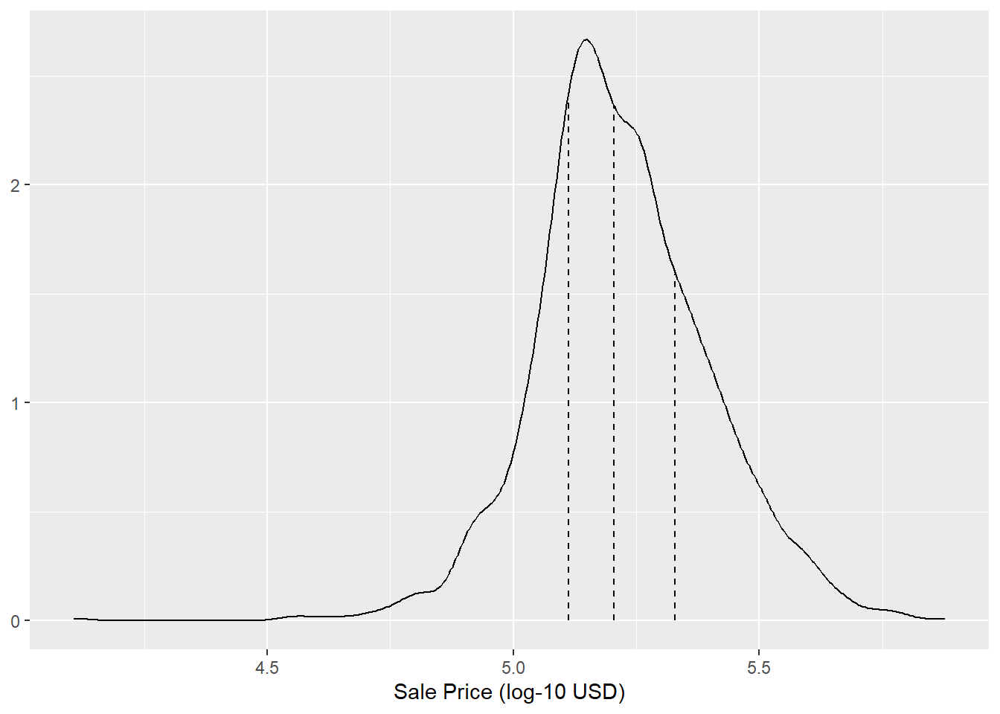

# Spending our Data {#splitting}

There are several steps to creating a useful model, including parameter estimation, model selection and tuning, and performance assessment. At the start of a new project, there is usually an initial finite pool of data available for all these tasks, which we can think of as an available data budget. How should the data be applied to different steps or tasks? The idea of _data spending_ is an important first consideration when modeling, especially as it relates to empirical validation. 

:::rmdwarning
When data are reused for multiple tasks, instead of carefully "spent" from the finite data budget, certain risks increase, such as the risk of accentuating bias or compounding effects from methodological errors.
:::

When there are copious amounts of data available, a smart strategy is to allocate specific subsets of data for different tasks, as opposed to allocating the largest possible amount (or even all) to the model parameter estimation only. For example, one possible strategy (when both data and predictors are abundant) is to spend a specific subset of data to determine which predictors are informative, before considering parameter estimation at all. If the initial pool of data available is not huge, there will be some overlap in how and when our data is "spent" or allocated, and a solid methodology for data spending is important. 

This chapter demonstrates the basics of _splitting_ (i.e., creating a data budget) for our initial pool of samples for different purposes. 

## Common Methods for Splitting Data {#splitting-methods}

The primary approach for empirical model validation is to split the existing pool of data into two distinct sets, the training set and the test set. One portion of the data is used to develop and optimize the model. This _training set_ is usually the majority of the data. These data are a sandbox for model building where different models can be fit, feature engineering strategies are investigated, and so on. As modeling practitioners, we spend the vast majority of the modeling process using the training set as the substrate to develop the model.  

The other portion of the data is placed into the _test set_. This is held in reserve until one or two models are chosen as the methods most likely to succeed. The test set is then used as the final arbiter to determine the efficacy of the model. It is critical to look at the test set only once; otherwise, it becomes part of the modeling process. 

:::rmdnote
How should we conduct this split of the data? The answer depends on the context. 
:::

Suppose we allocate 80% of the data to the training set and the remaining 20% for testing.  The most common method is to use simple random sampling. The [r pkg(rsample)](https://rsample.tidymodels.org/) package has tools for making data splits such as this; the function `initial_split()` was created for this purpose. It takes the data frame as an argument as well as the proportion to be placed into training. Using the data frame produced by the code snippet from the summary in Section \@ref(ames-summary) that prepared the Ames data set: 


```r
library(tidymodels)
tidymodels_prefer()

# Set the random number stream using `set.seed()` so that the results can be 
# reproduced later. 
set.seed(501)

# Save the split information for an 80/20 split of the data
ames_split <- initial_split(ames, prop = 0.80)
ames_split
```

```
## <Training/Testing/Total>
## <2344/586/2930>
```

The printed information denotes the amount of data in the training set ($n = 2,344$), the amount in the test set ($n = 586$), and the size of the original pool of samples  ($n = 2,930$). 

The object `ames_split` is an `rsplit` object and contains only the partitioning information; to get the resulting data sets, we apply two more functions:


```r
ames_train <- training(ames_split)
ames_test  <-  testing(ames_split)

dim(ames_train)
```

```
## [1] 2344   74
```

```r
dim(ames_test)
```

```
## [1] 586  74
```

```r
str(ames_train)
```

```
## tibble [2,344 × 74] (S3: tbl_df/tbl/data.frame)
##  $ MS_SubClass       : Factor w/ 16 levels "One_Story_1946_and_Newer_All_Styles",..: 2 1 6 1 16 5 1 11 1 1 ...
##  $ MS_Zoning         : Factor w/ 7 levels "Floating_Village_Residential",..: 3 3 3 3 4 4 3 3 3 3 ...
##  $ Lot_Frontage      : num [1:2344] 98 69 0 70 60 60 75 0 100 60 ...
##  $ Lot_Area          : int [1:2344] 8731 23580 7750 12243 10320 8520 9750 7032 17500 6600 ...
##  $ Street            : Factor w/ 2 levels "Grvl","Pave": 2 2 2 2 2 2 2 2 2 2 ...
##  $ Alley             : Factor w/ 3 levels "Gravel","No_Alley_Access",..: 2 2 2 2 1 1 2 2 2 2 ...
##  $ Lot_Shape         : Factor w/ 4 levels "Regular","Slightly_Irregular",..: 2 2 1 2 1 1 1 2 1 1 ...
##  $ Land_Contour      : Factor w/ 4 levels "Bnk","HLS","Low",..: 4 4 4 4 1 4 4 4 1 4 ...
##  $ Utilities         : Factor w/ 3 levels "AllPub","NoSeWa",..: 1 1 1 1 1 1 1 1 1 1 ...
##  $ Lot_Config        : Factor w/ 5 levels "Corner","CulDSac",..: 5 5 5 5 5 5 5 1 1 5 ...
##  $ Land_Slope        : Factor w/ 3 levels "Gtl","Mod","Sev": 1 2 1 1 1 1 1 1 2 1 ...
##  $ Neighborhood      : Factor w/ 29 levels "North_Ames","College_Creek",..: 12 11 7 9 14 3 2 1 13 1 ...
##  $ Condition_1       : Factor w/ 9 levels "Artery","Feedr",..: 3 3 7 3 1 1 3 3 4 5 ...
##  $ Condition_2       : Factor w/ 8 levels "Artery","Feedr",..: 3 3 3 3 3 3 3 3 3 3 ...
##  $ Bldg_Type         : Factor w/ 5 levels "OneFam","TwoFmCon",..: 1 1 1 1 2 1 1 3 1 1 ...
##  $ House_Style       : Factor w/ 8 levels "One_and_Half_Fin",..: 3 3 8 3 8 1 3 4 3 3 ...
##  $ Overall_Cond      : Factor w/ 10 levels "Very_Poor","Poor",..: 5 6 5 6 7 7 5 5 5 5 ...
##  $ Year_Built        : int [1:2344] 1920 1979 2003 1971 1915 1916 2000 1979 1954 1962 ...
##  $ Year_Remod_Add    : int [1:2344] 1950 1979 2003 1971 1965 1950 2001 1979 1954 1962 ...
##  $ Roof_Style        : Factor w/ 6 levels "Flat","Gable",..: 2 2 2 2 2 2 2 2 2 4 ...
##  $ Roof_Matl         : Factor w/ 8 levels "ClyTile","CompShg",..: 2 2 2 2 2 2 2 2 2 2 ...
##  $ Exterior_1st      : Factor w/ 16 levels "AsbShng","AsphShn",..: 13 10 14 10 9 13 14 9 7 15 ...
##  $ Exterior_2nd      : Factor w/ 17 levels "AsbShng","AsphShn",..: 14 11 15 11 9 14 15 9 7 16 ...
##  $ Mas_Vnr_Type      : Factor w/ 5 levels "BrkCmn","BrkFace",..: 4 4 4 4 4 4 2 4 5 4 ...
##  $ Mas_Vnr_Area      : num [1:2344] 0 0 0 0 0 0 171 0 420 0 ...
##  $ Exter_Cond        : Factor w/ 5 levels "Excellent","Fair",..: 2 5 5 5 3 3 5 5 5 5 ...
##  $ Foundation        : Factor w/ 6 levels "BrkTil","CBlock",..: 1 2 3 2 2 1 3 2 3 2 ...
##  $ Bsmt_Cond         : Factor w/ 6 levels "Excellent","Fair",..: 6 6 6 6 6 6 6 6 6 6 ...
##  $ Bsmt_Exposure     : Factor w/ 5 levels "Av","Gd","Mn",..: 4 2 4 1 4 4 4 2 1 4 ...
##  $ BsmtFin_Type_1    : Factor w/ 7 levels "ALQ","BLQ","GLQ",..: 2 3 7 1 6 6 7 3 4 1 ...
##  $ BsmtFin_SF_1      : num [1:2344] 2 3 7 1 6 6 7 3 4 1 ...
##  $ BsmtFin_Type_2    : Factor w/ 7 levels "ALQ","BLQ","GLQ",..: 7 7 7 7 1 4 7 7 2 2 ...
##  $ BsmtFin_SF_2      : num [1:2344] 0 0 0 0 262 546 0 0 435 442 ...
##  $ Bsmt_Unf_SF       : num [1:2344] 270 849 660 486 160 0 1630 0 91 312 ...
##  $ Total_Bsmt_SF     : num [1:2344] 915 1625 660 1484 698 ...
##  $ Heating           : Factor w/ 6 levels "Floor","GasA",..: 2 2 2 2 2 3 2 2 2 2 ...
##  $ Heating_QC        : Factor w/ 5 levels "Excellent","Fair",..: 5 5 1 3 1 5 1 5 1 3 ...
##  $ Central_Air       : Factor w/ 2 levels "N","Y": 2 2 2 2 2 1 2 2 2 2 ...
##  $ Electrical        : Factor w/ 6 levels "FuseA","FuseF",..: 5 5 5 5 2 5 5 5 5 5 ...
##  $ First_Flr_SF      : int [1:2344] 1167 1625 660 1484 754 1664 1630 943 1906 864 ...
##  $ Second_Flr_SF     : int [1:2344] 0 0 660 0 649 862 0 0 0 0 ...
##  $ Gr_Liv_Area       : int [1:2344] 1167 1625 1320 1484 1403 2526 1630 943 1906 864 ...
##  $ Bsmt_Full_Bath    : num [1:2344] 0 0 0 0 1 0 0 1 1 0 ...
##  $ Bsmt_Half_Bath    : num [1:2344] 0 1 0 0 0 0 0 0 0 0 ...
##  $ Full_Bath         : int [1:2344] 1 2 2 2 1 2 2 1 1 1 ...
##  $ Half_Bath         : int [1:2344] 0 0 1 0 1 0 0 0 1 0 ...
##  $ Bedroom_AbvGr     : int [1:2344] 3 3 3 3 3 5 3 2 3 2 ...
##  $ Kitchen_AbvGr     : int [1:2344] 1 1 1 1 1 1 1 1 1 1 ...
##  $ TotRms_AbvGrd     : int [1:2344] 6 6 6 7 7 10 6 4 6 5 ...
##  $ Functional        : Factor w/ 8 levels "Maj1","Maj2",..: 1 8 8 8 8 8 8 8 8 8 ...
##  $ Fireplaces        : int [1:2344] 1 1 0 1 0 1 1 2 2 0 ...
##  $ Garage_Type       : Factor w/ 7 levels "Attchd","Basment",..: 5 1 1 1 5 5 1 5 2 5 ...
##  $ Garage_Finish     : Factor w/ 4 levels "Fin","No_Garage",..: 4 1 1 4 4 4 4 4 4 4 ...
##  $ Garage_Cars       : num [1:2344] 2 2 2 2 1 1 2 2 2 1 ...
##  $ Garage_Area       : num [1:2344] 495 576 400 487 308 216 451 600 576 294 ...
##  $ Garage_Cond       : Factor w/ 6 levels "Excellent","Fair",..: 6 6 6 6 6 6 6 6 6 6 ...
##  $ Paved_Drive       : Factor w/ 3 levels "Dirt_Gravel",..: 3 3 3 3 3 3 3 3 3 3 ...
##  $ Wood_Deck_SF      : int [1:2344] 0 136 0 224 0 88 74 42 0 58 ...
##  $ Open_Porch_SF     : int [1:2344] 0 28 48 0 0 15 234 0 201 0 ...
##  $ Enclosed_Porch    : int [1:2344] 216 0 0 0 288 0 0 0 0 0 ...
##  $ Three_season_porch: int [1:2344] 0 0 0 0 0 0 0 0 0 0 ...
##  $ Screen_Porch      : int [1:2344] 126 0 0 180 0 0 0 0 0 0 ...
##  $ Pool_Area         : int [1:2344] 0 0 0 0 0 0 0 0 0 0 ...
##  $ Pool_QC           : Factor w/ 5 levels "Excellent","Fair",..: 4 4 4 4 4 4 4 4 4 4 ...
##  $ Fence             : Factor w/ 5 levels "Good_Privacy",..: 5 5 5 5 5 2 5 5 5 5 ...
##  $ Misc_Feature      : Factor w/ 6 levels "Elev","Gar2",..: 3 3 3 3 3 3 3 3 3 3 ...
##  $ Misc_Val          : int [1:2344] 0 0 0 0 0 0 0 0 0 0 ...
##  $ Mo_Sold           : int [1:2344] 5 9 8 2 2 8 10 12 1 12 ...
##  $ Year_Sold         : int [1:2344] 2007 2006 2007 2007 2009 2007 2009 2006 2009 2007 ...
##  $ Sale_Type         : Factor w/ 10 levels "COD","Con","ConLD",..: 10 10 10 10 10 6 10 10 10 10 ...
##  $ Sale_Condition    : Factor w/ 6 levels "Abnorml","AdjLand",..: 5 5 5 5 5 4 5 5 5 5 ...
##  $ Sale_Price        : num [1:2344] 5.16 5.38 5.21 5.24 5.06 ...
##  $ Longitude         : num [1:2344] -93.6 -93.6 -93.6 -93.6 -93.6 ...
##  $ Latitude          : num [1:2344] 42 42 42.1 42.1 42 ...
```

```r
str(ames_test)
```

```
## tibble [586 × 74] (S3: tbl_df/tbl/data.frame)
##  $ MS_SubClass       : Factor w/ 16 levels "One_Story_1946_and_Newer_All_Styles",..: 12 12 6 1 1 14 14 1 9 6 ...
##  $ MS_Zoning         : Factor w/ 7 levels "Floating_Village_Residential",..: 3 3 3 3 3 4 3 3 3 3 ...
##  $ Lot_Frontage      : num [1:586] 41 39 75 0 70 21 24 98 0 58 ...
##  $ Lot_Area          : int [1:586] 4920 5389 10000 12537 8400 1680 2280 11478 7750 16770 ...
##  $ Street            : Factor w/ 2 levels "Grvl","Pave": 2 2 2 2 2 2 2 2 2 2 ...
##  $ Alley             : Factor w/ 3 levels "Gravel","No_Alley_Access",..: 2 2 2 2 2 2 2 2 2 2 ...
##  $ Lot_Shape         : Factor w/ 4 levels "Regular","Slightly_Irregular",..: 1 2 2 2 1 1 1 1 2 3 ...
##  $ Land_Contour      : Factor w/ 4 levels "Bnk","HLS","Low",..: 4 4 4 4 4 4 4 4 4 4 ...
##  $ Utilities         : Factor w/ 3 levels "AllPub","NoSeWa",..: 1 1 1 1 1 1 1 1 1 1 ...
##  $ Lot_Config        : Factor w/ 5 levels "Corner","CulDSac",..: 5 5 1 2 1 5 3 5 5 2 ...
##  $ Land_Slope        : Factor w/ 3 levels "Gtl","Mod","Sev": 1 1 1 1 1 1 1 1 1 1 ...
##  $ Neighborhood      : Factor w/ 29 levels "North_Ames","College_Creek",..: 17 17 7 1 1 21 24 6 7 16 ...
##  $ Condition_1       : Factor w/ 9 levels "Artery","Feedr",..: 3 3 3 3 3 3 3 3 3 3 ...
##  $ Condition_2       : Factor w/ 8 levels "Artery","Feedr",..: 3 3 3 3 3 3 3 3 3 3 ...
##  $ Bldg_Type         : Factor w/ 5 levels "OneFam","TwoFmCon",..: 5 5 1 1 1 4 4 1 1 1 ...
##  $ House_Style       : Factor w/ 8 levels "One_and_Half_Fin",..: 3 3 8 3 3 8 8 3 5 8 ...
##  $ Overall_Cond      : Factor w/ 10 levels "Very_Poor","Poor",..: 5 5 5 6 5 5 6 5 5 5 ...
##  $ Year_Built        : int [1:586] 2001 1995 1993 1971 1970 1971 1975 2007 2000 1998 ...
##  $ Year_Remod_Add    : int [1:586] 2001 1996 1994 2008 1970 1971 1975 2008 2000 1998 ...
##  $ Roof_Style        : Factor w/ 6 levels "Flat","Gable",..: 2 2 2 2 2 2 2 2 2 2 ...
##  $ Roof_Matl         : Factor w/ 8 levels "ClyTile","CompShg",..: 2 2 2 2 2 2 2 2 2 2 ...
##  $ Exterior_1st      : Factor w/ 16 levels "AsbShng","AsphShn",..: 6 6 7 14 10 7 10 14 14 14 ...
##  $ Exterior_2nd      : Factor w/ 17 levels "AsbShng","AsphShn",..: 6 6 7 15 11 7 3 15 15 15 ...
##  $ Mas_Vnr_Type      : Factor w/ 5 levels "BrkCmn","BrkFace",..: 4 4 4 4 4 2 4 5 4 2 ...
##  $ Mas_Vnr_Area      : num [1:586] 0 0 0 0 0 504 0 200 0 30 ...
##  $ Exter_Cond        : Factor w/ 5 levels "Excellent","Fair",..: 5 5 5 5 5 5 5 5 5 5 ...
##  $ Foundation        : Factor w/ 6 levels "BrkTil","CBlock",..: 3 3 3 2 2 2 2 3 3 3 ...
##  $ Bsmt_Cond         : Factor w/ 6 levels "Excellent","Fair",..: 6 6 6 6 6 6 6 6 6 6 ...
##  $ Bsmt_Exposure     : Factor w/ 5 levels "Av","Gd","Mn",..: 3 4 4 4 4 4 4 4 4 4 ...
##  $ BsmtFin_Type_1    : Factor w/ 7 levels "ALQ","BLQ","GLQ",..: 3 3 7 3 1 6 1 3 3 7 ...
##  $ BsmtFin_SF_1      : num [1:586] 3 3 7 3 1 6 1 3 3 7 ...
##  $ BsmtFin_Type_2    : Factor w/ 7 levels "ALQ","BLQ","GLQ",..: 7 7 7 7 6 7 7 7 7 7 ...
##  $ BsmtFin_SF_2      : num [1:586] 0 0 0 0 78 0 0 0 0 0 ...
##  $ Bsmt_Unf_SF       : num [1:586] 722 415 763 344 0 ...
##  $ Total_Bsmt_SF     : num [1:586] 1338 1595 763 1078 882 ...
##  $ Heating           : Factor w/ 6 levels "Floor","GasA",..: 2 2 2 2 2 2 2 2 2 2 ...
##  $ Heating_QC        : Factor w/ 5 levels "Excellent","Fair",..: 1 1 3 1 5 5 5 1 1 3 ...
##  $ Central_Air       : Factor w/ 2 levels "N","Y": 2 2 2 2 2 2 2 2 2 2 ...
##  $ Electrical        : Factor w/ 6 levels "FuseA","FuseF",..: 5 5 5 5 5 5 5 5 5 5 ...
##  $ First_Flr_SF      : int [1:586] 1338 1616 763 1078 882 483 855 1704 774 1195 ...
##  $ Second_Flr_SF     : int [1:586] 0 0 892 0 0 504 601 0 656 644 ...
##  $ Gr_Liv_Area       : int [1:586] 1338 1616 1655 1078 882 987 1456 1704 1430 1839 ...
##  $ Bsmt_Full_Bath    : num [1:586] 1 1 0 1 1 0 0 1 0 0 ...
##  $ Bsmt_Half_Bath    : num [1:586] 0 0 0 0 0 0 0 0 0 0 ...
##  $ Full_Bath         : int [1:586] 2 2 2 1 1 1 2 2 2 2 ...
##  $ Half_Bath         : int [1:586] 0 0 1 1 0 1 1 0 1 1 ...
##  $ Bedroom_AbvGr     : int [1:586] 2 2 3 3 2 2 3 3 3 4 ...
##  $ Kitchen_AbvGr     : int [1:586] 1 1 1 1 1 1 1 1 1 1 ...
##  $ TotRms_AbvGrd     : int [1:586] 6 5 7 6 4 5 6 7 7 7 ...
##  $ Functional        : Factor w/ 8 levels "Maj1","Maj2",..: 8 8 8 8 8 8 8 8 8 8 ...
##  $ Fireplaces        : int [1:586] 0 1 1 1 0 0 1 1 1 0 ...
##  $ Garage_Type       : Factor w/ 7 levels "Attchd","Basment",..: 1 1 1 1 1 5 1 1 3 1 ...
##  $ Garage_Finish     : Factor w/ 4 levels "Fin","No_Garage",..: 1 3 1 1 1 4 4 3 1 1 ...
##  $ Garage_Cars       : num [1:586] 2 2 2 2 2 1 2 3 2 2 ...
##  $ Garage_Area       : num [1:586] 582 608 440 500 525 264 440 772 400 486 ...
##  $ Garage_Cond       : Factor w/ 6 levels "Excellent","Fair",..: 6 6 6 6 6 6 6 6 6 6 ...
##  $ Paved_Drive       : Factor w/ 3 levels "Dirt_Gravel",..: 3 3 3 3 3 3 3 3 3 3 ...
##  $ Wood_Deck_SF      : int [1:586] 0 237 157 0 240 275 173 0 180 0 ...
##  $ Open_Porch_SF     : int [1:586] 0 152 84 0 0 0 0 50 0 81 ...
##  $ Enclosed_Porch    : int [1:586] 170 0 0 0 0 0 0 0 0 0 ...
##  $ Three_season_porch: int [1:586] 0 0 0 0 0 0 0 0 0 0 ...
##  $ Screen_Porch      : int [1:586] 0 0 0 0 0 0 0 0 0 0 ...
##  $ Pool_Area         : int [1:586] 0 0 0 0 0 0 0 0 0 0 ...
##  $ Pool_QC           : Factor w/ 5 levels "Excellent","Fair",..: 4 4 4 4 4 4 4 4 4 4 ...
##  $ Fence             : Factor w/ 5 levels "Good_Privacy",..: 5 5 5 5 3 5 5 5 5 5 ...
##  $ Misc_Feature      : Factor w/ 6 levels "Elev","Gar2",..: 3 3 3 3 3 3 3 3 3 3 ...
##  $ Misc_Val          : int [1:586] 0 0 0 0 0 0 0 0 0 0 ...
##  $ Mo_Sold           : int [1:586] 4 3 4 4 4 2 6 5 4 6 ...
##  $ Year_Sold         : int [1:586] 2010 2010 2010 2010 2010 2010 2010 2010 2010 2010 ...
##  $ Sale_Type         : Factor w/ 10 levels "COD","Con","ConLD",..: 10 10 10 10 10 1 10 10 10 10 ...
##  $ Sale_Condition    : Factor w/ 6 levels "Abnorml","AdjLand",..: 5 5 5 5 5 5 5 5 5 5 ...
##  $ Sale_Price        : num [1:586] 5.33 5.37 5.25 5.18 5.1 ...
##  $ Longitude         : num [1:586] -93.6 -93.6 -93.6 -93.6 -93.6 ...
##  $ Latitude          : num [1:586] 42.1 42.1 42.1 42.1 42.1 ...
```

These objects are data frames with the same columns as the original data but only the appropriate rows for each set. 

Simple random sampling is appropriate in many cases but there are exceptions. When there is a dramatic _class imbalance_ in classification problems, one class occurs much less frequently than another. Using a simple random sample may haphazardly allocate these infrequent samples disproportionately into the training or test set. To avoid this, _stratified sampling_ can be used. The training/test split is conducted separately within each class and then these subsamples are combined into the overall training and test set. For regression problems, the outcome data can be artificially binned into quartiles and then stratified sampling can be conducted four separate times. This is an effective method for keeping the distributions of the outcome similar between the training and test set. The distribution of the sale price outcome for the Ames housing data is shown in Figure \@ref(fig:ames-sale-price). 

<div class="figure">

<p class="caption">The distribution of the sale price (in log units) for the Ames housing data. The vertical lines indicate the quartiles of the data</p>
</div>

As discussed in Chapter \@ref(ames), the sale price distribution is right-skewed, with proportionally more inexpensive houses than expensive houses on either side of the center of the distribution. The worry here with simple splitting is that the more expensive houses would not be well represented in the training set; this would increase the risk that our model would be ineffective at predicting the price for such properties.  The dotted vertical lines in Figure \@ref(fig:ames-sale-price) indicate the four quartiles for these data. A stratified random sample would conduct the 80/20 split within each of these data subsets and then pool the results. In r pkg(rsample), this is achieved using the `strata` argument: 


```r
set.seed(502)
ames_split <- initial_split(ames, prop = 0.80, strata = Sale_Price)
ames_train <- training(ames_split)
ames_test  <-  testing(ames_split)

dim(ames_train)
```

```
## [1] 2342   74
```

Only a single column can be used for stratification. 

:::rmdnote
There is very little downside to using stratified sampling. 
:::

Are there situations when random sampling is not the best choice? One case is when the data have a significant time component, such as time series data. Here, it is more common to use the most recent data as the test set. The r pkg(rsample) package contains a function called `initial_time_split()` that is very similar to `initial_split()`. Instead of using random sampling, the `prop` argument denotes what proportion of the first part of the data should be used as the training set; the function assumes that the data have been pre-sorted in an appropriate order. 

:::rmdnote
The proportion of data that should be allocated for splitting is highly dependent on the context of the problem at hand. Too little data in the training set hampers the model's ability to find appropriate parameter estimates. Conversely, too little data in the test set lowers the quality of the performance estimates. Parts of the statistics community eschew test sets in general because they believe all of the data should be used for parameter estimation. While there is merit to this argument, it is good modeling practice to have an unbiased set of observations as the final arbiter of model quality. A test set should be avoided only when the data are pathologically small.
:::

## What About a Validation Set? 

When describing the goals of data splitting, we singled out the test set as the data that should be used to properly evaluate of model performance on the final model(s). This begs the question: "How can we tell what is best if we don't measure performance until the test set?" 

It is common to hear about _validation sets_ as an answer to this question, especially in the neural network and deep learning literature. During the early days of neural networks, researchers realized that measuring performance by re-predicting the training set samples led to results that were overly optimistic (significantly, unrealistically so). This led to models that overfit, meaning that they performed very well on the training set but poorly on the test set.^[This is discussed in much greater detail in Section \@ref(overfitting-bad).] To combat this issue, a small validation set of data were held back and used to measure performance as the network was trained. Once the validation set error rate began to rise, the training would be halted. In other words, the validation set was a means to get a rough sense of how well the model performed prior to the test set. 

:::rmdnote
Whether validation sets are a subset of the training set or a third allocation in the initial split of the data largely comes down to semantics.
:::

Validation sets are discussed more in Section \@ref(validation) as a special case of _resampling_ methods that are used on the training set. If you are going to use a validation set, you can start with a different splitting function^[This interface is available as of rsample version 1.2.0 (circa September 2023).]: 


```r
set.seed(52)
# To put 60% into training, 20% in validation, and 20% in testing:
ames_val_split <- initial_validation_split(ames, prop = c(0.6, 0.2))
ames_val_split
```

```
## <Training/Validation/Testing/Total>
## <1758/586/586/2930>
```

```r
ames_val_split <- initial_validation_split(ames, prop = c(0.6, 0.2), strata = Sale_Price)
ames_val_split
```

```
## <Training/Validation/Testing/Total>
## <1756/587/587/2930>
```

Printing the split now shows the size of the training set (1,756), validation set (587), and test set ((587). 

To get the training, validation, and testing data, the same syntax is used: 


```r
ames_train <- training(ames_val_split)
ames_test <- testing(ames_val_split)
ames_val <- validation(ames_val_split)
```

Section \@ref(validation) will demonstrate how to use the `ames_val_split` object for resampling and model optimization.

## Multilevel Data

With the Ames housing data, a property is considered to be the _independent experimental unit_. It is safe to assume that, statistically, the data from a property are independent of other properties. For other applications, that is not always the case: 

 * For longitudinal data, for example, the same independent experimental unit can be measured over multiple time points. An example would be a human subject in a medical trial. 
 
 * A batch of manufactured product might also be considered the independent experimental unit. In repeated measures designs, replicate data points from a batch are collected at multiple times. 
 
 * @spicer2018 report an experiment where different trees were sampled across the top and bottom portions of a stem. Here, the tree is the experimental unit and the data hierarchy is sample within stem position within tree.  
 
Chapter 9 of @fes contains other examples. 

In these situations, the data set will have multiple rows per experimental unit. Simple resampling across rows would lead to some data within an experimental unit being in the training set and others in the test set. Data splitting should occur at the independent experimental unit level of the data. For example, to produce an 80/20 split of the Ames housing data set, 80% of the properties should be allocated for the training set.  


## Other Considerations for a Data Budget

When deciding how to spend the data available to you, keep a few more things in mind. First, it is critical to quarantine the test set from any model building activities. As you read this book, notice which data are exposed to the model at any given time.

:::rmdwarning
The problem of _information leakage_ occurs when data outside of the training set are used in the modeling process. 
:::

For example, in a machine learning competition, the test set data might be provided without the true outcome values so that the model can be scored and ranked. One potential method for improving the score might be to fit the model using the training set points that are most similar to the test set values. While the test set isn't directly used to fit the model, it still has a heavy influence. In general, this technique is highly problematic since it reduces the _generalization error_ of the model to optimize performance on a specific data set. There are more subtle ways that the test set data can be used during training. Keeping the training data in a separate data frame from the test set is one small check to make sure that information leakage does not occur by accident. 

Second, techniques to subsample the training set can mitigate specific issues (e.g., class imbalances). This is a valid and common technique that deliberately results in the training set data diverging from the population from which the data were drawn. It is critical that the test set continues to mirror what the model would encounter in the wild. In other words, the test set should always resemble new data that will be given to the model. 
 
Next, at the beginning of this chapter, we warned about using the same data for different tasks. Chapter \@ref(resampling) will discuss solid, data-driven methodologies for data usage that will reduce the risks related to bias, overfitting, and other issues. Many of these methods apply the data-splitting tools introduced in this chapter.  

Finally, the considerations in this chapter apply to developing and choosing a reliable model, the main topic of this book. When training a final chosen model for production, after ascertaining the expected performance on new data, practitioners often use all available data for better parameter estimation.


## Chapter Summary {#splitting-summary}
 
Data splitting is the fundamental strategy for empirical validation of models. Even in the era of unrestrained data collection, a typical modeling project has a limited amount of appropriate data, and wise spending of a project's data is necessary. In this chapter, we discussed several strategies for partitioning the data into distinct groups for modeling and evaluation. 

At this checkpoint, the important code snippets for preparing and splitting are:


```r
library(tidymodels)
data(ames)
ames <- ames %>% mutate(Sale_Price = log10(Sale_Price))

set.seed(502)
ames_split <- initial_split(ames, prop = 0.80, strata = Sale_Price)
ames_train <- training(ames_split)
ames_test  <-  testing(ames_split)
```
