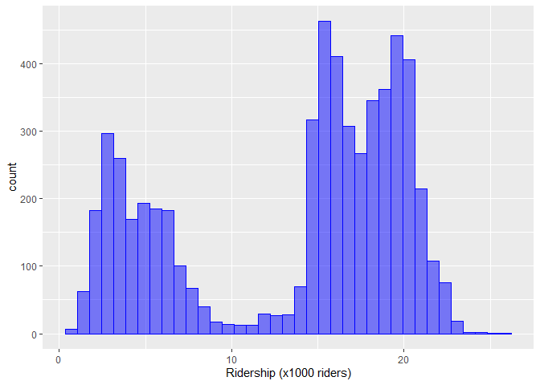
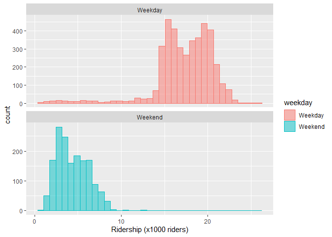
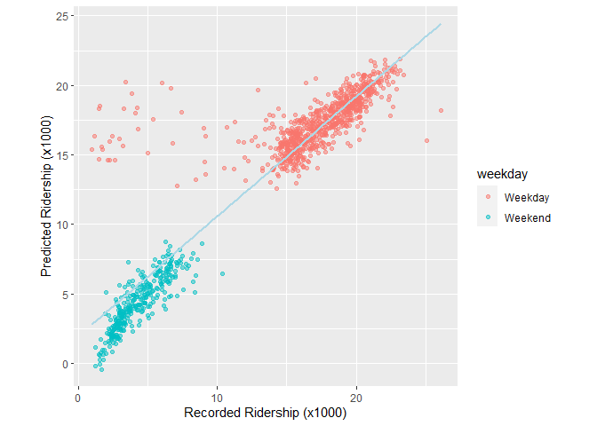

We will practice using the Chicago data set on public transit ridership.  You can access it with:


```r
library(modeldata)
data("Chicago")
Chicago
```

Read about it with `?Chicago`; read more about it in [Kuhn and Johnson](https://bookdown.org/max/FES/chicago-intro.html)


```r
#?Chicago
```


```r
library(tidymodels)
```

```
## ── Attaching packages ────────────────────────────────────── tidymodels 1.1.1 ──
```

```
## ✔ broom        1.0.5     ✔ recipes      1.0.9
## ✔ dials        1.2.0     ✔ rsample      1.2.0
## ✔ dplyr        1.1.4     ✔ tibble       3.2.1
## ✔ ggplot2      3.4.4     ✔ tidyr        1.3.0
## ✔ infer        1.0.5     ✔ tune         1.1.2
## ✔ modeldata    1.2.0     ✔ workflows    1.1.3
## ✔ parsnip      1.1.1     ✔ workflowsets 1.0.1
## ✔ purrr        1.0.2     ✔ yardstick    1.2.0
```

```
## ── Conflicts ───────────────────────────────────────── tidymodels_conflicts() ──
## ✖ purrr::discard() masks scales::discard()
## ✖ dplyr::filter()  masks stats::filter()
## ✖ dplyr::lag()     masks stats::lag()
## ✖ recipes::step()  masks stats::step()
## • Search for functions across packages at https://www.tidymodels.org/find/
```

```r
library(lubridate)
```

```
## 
## Attaching package: 'lubridate'
```

```
## The following objects are masked from 'package:base':
## 
##     date, intersect, setdiff, union
```

```r
library(tidyverse)
```

```
## ── Attaching core tidyverse packages ──────────────────────── tidyverse 2.0.0 ──
## ✔ forcats 1.0.0     ✔ stringr 1.5.1
## ✔ readr   2.1.4
```

```
## ── Conflicts ────────────────────────────────────────── tidyverse_conflicts() ──
## ✖ readr::col_factor() masks scales::col_factor()
## ✖ purrr::discard()    masks scales::discard()
## ✖ dplyr::filter()     masks stats::filter()
## ✖ stringr::fixed()    masks recipes::fixed()
## ✖ dplyr::lag()        masks stats::lag()
## ✖ readr::spec()       masks yardstick::spec()
## ℹ Use the conflicted package (<http://conflicted.r-lib.org/>) to force all conflicts to become errors
```

```r
library(ggplot2)
library(workflowsets)
```


## 1.  Explore the data

1. Make a histogram of ridership.  


```r
str(Chicago)
```

```
## tibble [5,698 × 50] (S3: tbl_df/tbl/data.frame)
##  $ ridership       : num [1:5698] 15.7 15.8 15.9 15.9 15.4 ...
##  $ Austin          : num [1:5698] 1.46 1.5 1.52 1.49 1.5 ...
##  $ Quincy_Wells    : num [1:5698] 8.37 8.35 8.36 7.85 7.62 ...
##  $ Belmont         : num [1:5698] 4.6 4.72 4.68 4.77 4.72 ...
##  $ Archer_35th     : num [1:5698] 2.01 2.09 2.11 2.17 2.06 ...
##  $ Oak_Park        : num [1:5698] 1.42 1.43 1.49 1.45 1.42 ...
##  $ Western         : num [1:5698] 3.32 3.34 3.36 3.36 3.27 ...
##  $ Clark_Lake      : num [1:5698] 15.6 15.7 15.6 15.7 15.6 ...
##  $ Clinton         : num [1:5698] 2.4 2.4 2.37 2.42 2.42 ...
##  $ Merchandise_Mart: num [1:5698] 6.48 6.48 6.41 6.49 5.8 ...
##  $ Irving_Park     : num [1:5698] 3.74 3.85 3.86 3.84 3.88 ...
##  $ Washington_Wells: num [1:5698] 7.56 7.58 7.62 7.36 7.09 ...
##  $ Harlem          : num [1:5698] 2.65 2.76 2.79 2.81 2.73 ...
##  $ Monroe          : num [1:5698] 5.67 6.01 5.79 5.96 5.77 ...
##  $ Polk            : num [1:5698] 2.48 2.44 2.53 2.45 2.57 ...
##  $ Ashland         : num [1:5698] 1.32 1.31 1.32 1.35 1.35 ...
##  $ Kedzie          : num [1:5698] 3.01 3.02 2.98 3.01 3.08 ...
##  $ Addison         : num [1:5698] 2.5 2.57 2.59 2.53 2.56 ...
##  $ Jefferson_Park  : num [1:5698] 6.59 6.75 6.97 7.01 6.92 ...
##  $ Montrose        : num [1:5698] 1.84 1.92 1.98 1.98 1.95 ...
##  $ California      : num [1:5698] 0.756 0.781 0.812 0.776 0.789 0.37 0.274 0.473 0.844 0.835 ...
##  $ temp_min        : num [1:5698] 15.1 25 19 15.1 21 19 15.1 26.6 34 33.1 ...
##  $ temp            : num [1:5698] 19.4 30.4 25 22.4 27 ...
##  $ temp_max        : num [1:5698] 30 36 28.9 27 32 30 28.9 41 43 36 ...
##  $ temp_change     : num [1:5698] 14.9 11 9.9 11.9 11 11 13.8 14.4 9 2.9 ...
##  $ dew             : num [1:5698] 13.4 25 18 10.9 21.9 ...
##  $ humidity        : num [1:5698] 78 79 81 66.5 84 71 74 93 93 89 ...
##  $ pressure        : num [1:5698] 30.4 30.2 30.2 30.4 29.9 ...
##  $ pressure_change : num [1:5698] 0.12 0.18 0.23 0.16 0.65 ...
##  $ wind            : num [1:5698] 5.2 8.1 10.4 9.8 12.7 12.7 8.1 8.1 9.2 11.5 ...
##  $ wind_max        : num [1:5698] 10.4 11.5 19.6 16.1 19.6 17.3 13.8 17.3 23 16.1 ...
##  $ gust            : num [1:5698] 0 0 0 0 0 0 0 0 0 0 ...
##  $ gust_max        : num [1:5698] 0 0 0 0 25.3 26.5 0 26.5 31.1 0 ...
##  $ percip          : num [1:5698] 0 0 0 0 0 0 0 0 0 0 ...
##  $ percip_max      : num [1:5698] 0 0 0 0 0 0 0 0.07 0.11 0.01 ...
##  $ weather_rain    : num [1:5698] 0 0 0 0 0 ...
##  $ weather_snow    : num [1:5698] 0 0 0.214 0 0.516 ...
##  $ weather_cloud   : num [1:5698] 0.708 1 0.357 0.292 0.452 ...
##  $ weather_storm   : num [1:5698] 0 0.2083 0.0714 0.0417 0.4516 ...
##  $ Blackhawks_Away : num [1:5698] 0 0 0 0 0 0 0 0 0 0 ...
##  $ Blackhawks_Home : num [1:5698] 0 0 0 0 0 0 0 0 0 0 ...
##  $ Bulls_Away      : num [1:5698] 0 0 1 0 0 0 0 0 1 0 ...
##  $ Bulls_Home      : num [1:5698] 0 1 0 0 0 1 0 0 0 0 ...
##  $ Bears_Away      : num [1:5698] 0 0 0 0 0 0 0 0 0 0 ...
##  $ Bears_Home      : num [1:5698] 0 0 0 0 0 0 0 0 0 0 ...
##  $ WhiteSox_Away   : num [1:5698] 0 0 0 0 0 0 0 0 0 0 ...
##  $ WhiteSox_Home   : num [1:5698] 0 0 0 0 0 0 0 0 0 0 ...
##  $ Cubs_Away       : num [1:5698] 0 0 0 0 0 0 0 0 0 0 ...
##  $ Cubs_Home       : num [1:5698] 0 0 0 0 0 0 0 0 0 0 ...
##  $ date            : Date[1:5698], format: "2001-01-22" "2001-01-23" ...
```

```r
stations
```

```
##  [1] "Austin"           "Quincy_Wells"     "Belmont"          "Archer_35th"     
##  [5] "Oak_Park"         "Western"          "Clark_Lake"       "Clinton"         
##  [9] "Merchandise_Mart" "Irving_Park"      "Washington_Wells" "Harlem"          
## [13] "Monroe"           "Polk"             "Ashland"          "Kedzie"          
## [17] "Addison"          "Jefferson_Park"   "Montrose"         "California"
```

> Ridership is measured by the number of entries into a station across all turnstiles, and the number of daily riders across stations during this time period varied considerably, ranging between 0 and 36,323 per day. 

> For ease of presentation, ridership will be shown and analyzed in units of thousands of riders.


```r
y_hist <- 
  ggplot(Chicago, aes(ridership)) +   
  geom_histogram(binwidth = .7, fill = "blue", col = "blue", alpha = .5) +
  xlab("Ridership (x1000 riders)")

y_hist
```

<!-- -->

2. What might be causing the two peaks.  Is there a predictor variable that can account for this (or that can be used to make a new variable to account for it)?

I am not suggesting that you do regressions or plots on all variables at this time, rather that you think about what might have this kind of impact.

If you need to make a new predictor variable, go ahead.


```r
Chicago_week <- Chicago %>%
  mutate(dow = as.character(wday(ymd(date), label = T))) %>% 
  mutate(weekday = as.factor(ifelse(dow %in% c("Sat","Sun"), "Weekend", "Weekday")))
Chicago_week
```

```
## # A tibble: 5,698 × 52
##    ridership Austin Quincy_Wells Belmont Archer_35th Oak_Park Western Clark_Lake
##        <dbl>  <dbl>        <dbl>   <dbl>       <dbl>    <dbl>   <dbl>      <dbl>
##  1     15.7   1.46         8.37     4.60       2.01     1.42    3.32       15.6 
##  2     15.8   1.50         8.35     4.72       2.09     1.43    3.34       15.7 
##  3     15.9   1.52         8.36     4.68       2.11     1.49    3.36       15.6 
##  4     15.9   1.49         7.85     4.77       2.17     1.44    3.36       15.7 
##  5     15.4   1.50         7.62     4.72       2.06     1.42    3.27       15.6 
##  6      2.42  0.693        0.911    2.27       0.624    0.426   1.11        2.41
##  7      1.47  0.408        0.414    1.63       0.378    0.225   0.567       1.37
##  8     15.5   0.987        4.81     3.52       1.34     0.879   1.94        9.02
##  9     15.9   1.55         8.23     4.71       2.22     1.46    3.46       16.0 
## 10     15.9   1.59         8.25     4.77       2.23     1.48    3.51       15.8 
## # ℹ 5,688 more rows
## # ℹ 44 more variables: Clinton <dbl>, Merchandise_Mart <dbl>,
## #   Irving_Park <dbl>, Washington_Wells <dbl>, Harlem <dbl>, Monroe <dbl>,
## #   Polk <dbl>, Ashland <dbl>, Kedzie <dbl>, Addison <dbl>,
## #   Jefferson_Park <dbl>, Montrose <dbl>, California <dbl>, temp_min <dbl>,
## #   temp <dbl>, temp_max <dbl>, temp_change <dbl>, dew <dbl>, humidity <dbl>,
## #   pressure <dbl>, pressure_change <dbl>, wind <dbl>, wind_max <dbl>, …
```

```r
fig_Chicago_week <- 
  ggplot(Chicago_week, aes(ridership, fill = weekday, col = weekday)) + 
  facet_wrap( ~ weekday, nrow = 2, scales = "free_y") +
  geom_histogram(binwidth = .7, alpha = .5) +
  xlab("Ridership (x1000 riders)")
fig_Chicago_week
```

<!-- -->

> A reasonable explanation for this would be that ridership is different for weekdays than for weekends. 

> This is important and necessary for explaining ridership and should be included in a model.

## 2. Training and Test

Make an 80/20 train/test split.  Do you need to stratify over anything?  

So that we are working on the same split, use `set.seed(010324)` in you code chunk


```r
set.seed(010324)

Chicago_split <- initial_split(Chicago_week, prop = 0.80, strata = ridership)
Chicago_train <- training(Chicago_split)
Chicago_test  <-  testing(Chicago_split)
```


```r
dim(Chicago_week)
```

```
## [1] 5698   52
```

```r
dim(Chicago_train)
```

```
## [1] 4557   52
```

```r
dim(Chicago_test)
```

```
## [1] 1141   52
```

## 3. Workflow set

Let's compare the effectiveness  of the temp and percip [sic] predictors.  

### 3A 

Use a workflow set (see chapter 7) to fit six models, each of which has your predictor from Q1 along with one of the following variables:

`temp_min`, `temp`, `temp_max`, `temp_change`, `percip`, `percip_max`

The formula for one of these would be something like `ridership ~ temp_min + Q1_predictor`.


```r
lm_model <- linear_reg() %>% set_engine("lm")
```


```r
weather <- list(
  temp_min = ridership ~ temp_min + weekday,
  temp = ridership ~ temp + weekday,
  temp_max = ridership ~ temp_max + weekday,
  temp_change = ridership ~ temp_change + weekday,
  percip = ridership ~ percip + weekday,
  percip_max = ridership ~ percip_max + weekday
)
```


```r
weather_models <- workflow_set(preproc = weather, 
                               models = list(lm = lm_model))
weather_models
```

```
## # A workflow set/tibble: 6 × 4
##   wflow_id       info             option    result    
##   <chr>          <list>           <list>    <list>    
## 1 temp_min_lm    <tibble [1 × 4]> <opts[0]> <list [0]>
## 2 temp_lm        <tibble [1 × 4]> <opts[0]> <list [0]>
## 3 temp_max_lm    <tibble [1 × 4]> <opts[0]> <list [0]>
## 4 temp_change_lm <tibble [1 × 4]> <opts[0]> <list [0]>
## 5 percip_lm      <tibble [1 × 4]> <opts[0]> <list [0]>
## 6 percip_max_lm  <tibble [1 × 4]> <opts[0]> <list [0]>
```


```r
weather_models$info[[1]]
```

```
## # A tibble: 1 × 4
##   workflow   preproc model      comment
##   <list>     <chr>   <chr>      <chr>  
## 1 <workflow> formula linear_reg ""
```


```r
extract_workflow(weather_models, id = "temp_lm")
```

```
## ══ Workflow ════════════════════════════════════════════════════════════════════
## Preprocessor: Formula
## Model: linear_reg()
## 
## ── Preprocessor ────────────────────────────────────────────────────────────────
## ridership ~ temp + weekday
## 
## ── Model ───────────────────────────────────────────────────────────────────────
## Linear Regression Model Specification (regression)
## 
## Computational engine: lm
```


```r
weather_models <-
   weather_models %>%
   mutate(fit = map(info, ~ fit(.x$workflow[[1]], Chicago_train)))
weather_models
```

```
## # A workflow set/tibble: 6 × 5
##   wflow_id       info             option    result     fit       
##   <chr>          <list>           <list>    <list>     <list>    
## 1 temp_min_lm    <tibble [1 × 4]> <opts[0]> <list [0]> <workflow>
## 2 temp_lm        <tibble [1 × 4]> <opts[0]> <list [0]> <workflow>
## 3 temp_max_lm    <tibble [1 × 4]> <opts[0]> <list [0]> <workflow>
## 4 temp_change_lm <tibble [1 × 4]> <opts[0]> <list [0]> <workflow>
## 5 percip_lm      <tibble [1 × 4]> <opts[0]> <list [0]> <workflow>
## 6 percip_max_lm  <tibble [1 × 4]> <opts[0]> <list [0]> <workflow>
```

### 3B 

Compare the model fits / predictors (this can be using any of the p-value of the predictor, R2, AIC, log-lik).  Don't worry about the test set, just compare goodness of fit when fit with the training set.


```r
weather_models %>%
  mutate(tidy=map(fit, tidy)) %>%
  unnest(tidy) %>%
  filter(str_detect(term, "temp|percip")) %>%
  arrange(p.value)
```

```
## # A tibble: 6 × 10
##   wflow_id       info     option    result fit        term    estimate std.error
##   <chr>          <list>   <list>    <list> <list>     <chr>      <dbl>     <dbl>
## 1 temp_lm        <tibble> <opts[0]> <list> <workflow> temp      0.0383   0.00217
## 2 temp_min_lm    <tibble> <opts[0]> <list> <workflow> temp_m…   0.0392   0.00223
## 3 temp_max_lm    <tibble> <opts[0]> <list> <workflow> temp_m…   0.0360   0.00205
## 4 temp_change_lm <tibble> <opts[0]> <list> <workflow> temp_c…   0.0313   0.00710
## 5 percip_max_lm  <tibble> <opts[0]> <list> <workflow> percip…   1.11     0.346  
## 6 percip_lm      <tibble> <opts[0]> <list> <workflow> percip   -7.58    12.6    
## # ℹ 2 more variables: statistic <dbl>, p.value <dbl>
```


## 4 Recipes

### 4A

Create a workflow recipe does the following:

* normalizes all weather and station predictors
* creates a set of PCs for the weather-related predictors, keeping enough PCs to explain 75% of the variance in the weather variables
* creates a second set of PCs for the station-related predictors, keeping enough PCs to explaining 75% of the variance in these variables

Hint: `tidy()`, `prep()`, and `bake()` methods for recipes may be helpful in examining what you have done.  The help file on `recipe` is good to0.

Hint2: You can use various dplyr::select functions and regular expressions to avoid having to type out the variable names.  But as a fair-warning, it took me a lot longer to figure that out than it would have to just type then out.  (But next time it might be faster).  I can demo.


```r
recipe(ridership ~ ., data = Chicago_train) %>%
  add_role(Austin:California, new_role = "station") %>%
  add_role(temp_min:weather_storm, new_role = "weather")
```

```
## 
```

```
## ── Recipe ──────────────────────────────────────────────────────────────────────
```

```
## 
```

```
## ── Inputs
```

```
## Number of variables by role
```

```
## outcome:    1
## predictor: 51
## station:   20
## weather:   18
```


```r
recipe(ridership ~ ., data = Chicago_train) %>%
  add_role(Austin:California, new_role = "station") %>%
  add_role(temp_min:weather_storm, new_role = "weather") %>%
  step_normalize(has_role("station")) %>%
  step_normalize(has_role("weather")) 
```

```
## 
```

```
## ── Recipe ──────────────────────────────────────────────────────────────────────
```

```
## 
```

```
## ── Inputs
```

```
## Number of variables by role
```

```
## outcome:    1
## predictor: 51
## station:   20
## weather:   18
```

```
## 
```

```
## ── Operations
```

```
## • Centering and scaling for: has_role("station")
```

```
## • Centering and scaling for: has_role("weather")
```

```r
recipe(ridership ~ ., data = Chicago_train) %>%
  add_role(Austin:California, new_role = "station") %>%
  add_role(temp_min:weather_storm, new_role = "weather") %>%
  step_normalize(has_role("station")) %>%
  step_normalize(has_role("weather")) %>%
  step_pca(has_role("station"), threshold = .75, prefix = "station_PC", id = "station_pca") %>%
  step_pca(has_role("weather"), threshold = .75, prefix = "weather_PC", id = "weather_pca")
```

```
## 
```

```
## ── Recipe ──────────────────────────────────────────────────────────────────────
```

```
## 
```

```
## ── Inputs
```

```
## Number of variables by role
```

```
## outcome:    1
## predictor: 51
## station:   20
## weather:   18
```

```
## 
```

```
## ── Operations
```

```
## • Centering and scaling for: has_role("station")
```

```
## • Centering and scaling for: has_role("weather")
```

```
## • PCA extraction with: has_role("station")
```

```
## • PCA extraction with: has_role("weather")
```


```r
Chicago_rec <- 
  recipe(ridership ~ ., data = Chicago_train) %>%
  add_role(Austin:California, new_role = "station") %>%
  add_role(temp_min:weather_storm, new_role = "weather") %>%
  step_normalize(has_role("station")) %>%
  step_normalize(has_role("weather")) %>%
  step_pca(has_role("station"), threshold = .75, prefix = "station_PC", id = "station_pca") %>%
  step_pca(has_role("weather"), threshold = .75, prefix = "weather_PC", id = "weather_pca")

Chicago_rec
```

```
## 
```

```
## ── Recipe ──────────────────────────────────────────────────────────────────────
```

```
## 
```

```
## ── Inputs
```

```
## Number of variables by role
```

```
## outcome:    1
## predictor: 51
## station:   20
## weather:   18
```

```
## 
```

```
## ── Operations
```

```
## • Centering and scaling for: has_role("station")
```

```
## • Centering and scaling for: has_role("weather")
```

```
## • PCA extraction with: has_role("station")
```

```
## • PCA extraction with: has_role("weather")
```


```r
tidy(Chicago_rec)
```

```
## # A tibble: 4 × 6
##   number operation type      trained skip  id             
##    <int> <chr>     <chr>     <lgl>   <lgl> <chr>          
## 1      1 step      normalize FALSE   FALSE normalize_viLm0
## 2      2 step      normalize FALSE   FALSE normalize_LApdr
## 3      3 step      pca       FALSE   FALSE station_pca    
## 4      4 step      pca       FALSE   FALSE weather_pca
```


### 4B

Use the recipe from 4A to fit a linear regression of ridership on the new PCs and all remaining predictors (i.e. those not used in making the PCs).  Use the training data.


```r
lm_wflow <- 
  workflow() %>% 
  add_model(lm_model) %>% 
  add_recipe(Chicago_rec)

lm_fit <- fit(lm_wflow, Chicago_train)

tidy(lm_fit)
```

```
## # A tibble: 26 × 5
##    term            estimate std.error statistic   p.value
##    <chr>              <dbl>     <dbl>     <dbl>     <dbl>
##  1 (Intercept)       2.83      0.338      8.36   8.20e-17
##  2 Blackhawks_Away  -0.0493    0.114     -0.432  6.66e- 1
##  3 Blackhawks_Home   0.0191    0.118      0.162  8.71e- 1
##  4 Bulls_Away       -0.0524    0.114     -0.458  6.47e- 1
##  5 Bulls_Home        0.204     0.115      1.78   7.54e- 2
##  6 Bears_Away        0.0424    0.227      0.187  8.52e- 1
##  7 Bears_Home        0.207     0.212      0.975  3.29e- 1
##  8 WhiteSox_Away    -0.308     0.0980    -3.14   1.69e- 3
##  9 WhiteSox_Home    NA        NA         NA     NA       
## 10 Cubs_Away        NA        NA         NA     NA       
## # ℹ 16 more rows
```

```r
tidy(lm_fit) %>% select(term, p.value)
```

```
## # A tibble: 26 × 2
##    term              p.value
##    <chr>               <dbl>
##  1 (Intercept)      8.20e-17
##  2 Blackhawks_Away  6.66e- 1
##  3 Blackhawks_Home  8.71e- 1
##  4 Bulls_Away       6.47e- 1
##  5 Bulls_Home       7.54e- 2
##  6 Bears_Away       8.52e- 1
##  7 Bears_Home       3.29e- 1
##  8 WhiteSox_Away    1.69e- 3
##  9 WhiteSox_Home   NA       
## 10 Cubs_Away       NA       
## # ℹ 16 more rows
```


### 4C

Use the fit from 4B to predict ridership in the test data.  Evaluate the predictions.


```r
str(Chicago_test)
```

```
## tibble [1,141 × 52] (S3: tbl_df/tbl/data.frame)
##  $ ridership       : num [1:1141] 2.48 1.56 15.58 15.79 16.16 ...
##  $ Austin          : num [1:1141] 0.663 0.411 1.592 1.583 1.603 ...
##  $ Quincy_Wells    : num [1:1141] 0.914 0.454 8.165 7.876 8.13 ...
##  $ Belmont         : num [1:1141] 2.28 1.64 4.69 4.69 4.77 ...
##  $ Archer_35th     : num [1:1141] 0.643 0.337 2.211 2.219 2.206 ...
##  $ Oak_Park        : num [1:1141] 0.402 0.212 1.479 1.435 1.45 ...
##  $ Western         : num [1:1141] 1.037 0.562 3.425 3.517 3.447 ...
##  $ Clark_Lake      : num [1:1141] 2.32 1.49 15.92 16.16 15.69 ...
##  $ Clinton         : num [1:1141] 0.78 0.579 2.426 2.203 2.367 ...
##  $ Merchandise_Mart: num [1:1141] 0.858 0.267 6.407 6.254 6.032 ...
##  $ Irving_Park     : num [1:1141] 1.75 1.18 3.88 3.77 3.75 ...
##  $ Washington_Wells: num [1:1141] 0.738 0.34 7.521 7.354 7.267 ...
##  $ Harlem          : num [1:1141] 1.015 0.626 2.79 2.771 2.809 ...
##  $ Monroe          : num [1:1141] 1.066 0.671 6.18 6.079 6.269 ...
##  $ Polk            : num [1:1141] 0.01 0 2.44 2.41 2.51 ...
##  $ Ashland         : num [1:1141] 0.563 0.323 1.379 1.386 1.367 ...
##  $ Kedzie          : num [1:1141] 1.158 0.675 3.069 3.129 3.157 ...
##  $ Addison         : num [1:1141] 0.782 0.506 2.481 2.579 2.645 ...
##  $ Jefferson_Park  : num [1:1141] 2.69 1.95 6.9 6.82 6.92 ...
##  $ Montrose        : num [1:1141] 0.739 0.49 1.977 2.042 2.038 ...
##  $ California      : num [1:1141] 0.361 0.263 0.815 0.804 0.803 0.388 0.841 0.362 0.487 0.315 ...
##  $ temp_min        : num [1:1141] 10 30 32 19 21 26.6 21.2 25 28 19.4 ...
##  $ temp            : num [1:1141] 17.1 34 37 22.4 25 ...
##  $ temp_max        : num [1:1141] 30 36 37.9 28.9 42.1 48 34 50 42.1 28 ...
##  $ temp_change     : num [1:1141] 20 6 5.9 9.9 21.1 21.4 12.8 25 14.1 8.6 ...
##  $ dew             : num [1:1141] 12 30 35.1 18 12 28 15.1 21 12.9 12 ...
##  $ humidity        : num [1:1141] 75 82 93 78 55 82 61 65 47 68 ...
##  $ pressure        : num [1:1141] 30.2 30 30 30.2 30 ...
##  $ pressure_change : num [1:1141] 0.29 0.15 0.26 0.44 0.31 ...
##  $ wind            : num [1:1141] 11.5 6.9 6.9 7.5 12.7 0 15 6.9 16.1 13.8 ...
##  $ wind_max        : num [1:1141] 15 12.7 18.4 21.9 19.6 8.1 18.4 24.2 23 18.4 ...
##  $ gust            : num [1:1141] 0 0 0 0 0 ...
##  $ gust_max        : num [1:1141] 26.5 0 0 26.5 25.3 0 27.6 31.1 28.8 25.3 ...
##  $ percip          : num [1:1141] 0 0 0.01 0 0 0 0 0 0 0 ...
##  $ percip_max      : num [1:1141] 0 0.01 0.07 0 0 0 0 0 0 0 ...
##  $ weather_rain    : num [1:1141] 0 0 0.6 0 0 0 0 0 0 0 ...
##  $ weather_snow    : num [1:1141] 0.1852 0.2069 0.0286 0.2692 0.04 ...
##  $ weather_cloud   : num [1:1141] 0.815 0.793 0.343 0.731 0.48 ...
##  $ weather_storm   : num [1:1141] 0.593 0.724 0.257 0.731 0.16 ...
##  $ Blackhawks_Away : num [1:1141] 0 0 0 0 0 0 0 0 0 0 ...
##  $ Blackhawks_Home : num [1:1141] 0 0 0 0 0 0 0 0 0 0 ...
##  $ Bulls_Away      : num [1:1141] 1 0 0 0 0 1 0 1 0 1 ...
##  $ Bulls_Home      : num [1:1141] 0 0 0 1 0 0 1 0 0 0 ...
##  $ Bears_Away      : num [1:1141] 0 0 0 0 0 0 0 0 0 0 ...
##  $ Bears_Home      : num [1:1141] 0 0 0 0 0 0 0 0 0 0 ...
##  $ WhiteSox_Away   : num [1:1141] 0 0 0 0 0 0 0 0 0 0 ...
##  $ WhiteSox_Home   : num [1:1141] 0 0 0 0 0 0 0 0 0 0 ...
##  $ Cubs_Away       : num [1:1141] 0 0 0 0 0 0 0 0 0 0 ...
##  $ Cubs_Home       : num [1:1141] 0 0 0 0 0 0 0 0 0 0 ...
##  $ date            : Date[1:1141], format: "2001-02-03" "2001-02-04" ...
##  $ dow             : chr [1:1141] "Sat" "Sun" "Wed" "Thu" ...
##  $ weekday         : Factor w/ 2 levels "Weekday","Weekend": 2 2 1 1 1 2 1 2 2 2 ...
```

```r
Chicago_test_nor <- Chicago_test %>% select(-ridership)
str(Chicago_test_nor)
```

```
## tibble [1,141 × 51] (S3: tbl_df/tbl/data.frame)
##  $ Austin          : num [1:1141] 0.663 0.411 1.592 1.583 1.603 ...
##  $ Quincy_Wells    : num [1:1141] 0.914 0.454 8.165 7.876 8.13 ...
##  $ Belmont         : num [1:1141] 2.28 1.64 4.69 4.69 4.77 ...
##  $ Archer_35th     : num [1:1141] 0.643 0.337 2.211 2.219 2.206 ...
##  $ Oak_Park        : num [1:1141] 0.402 0.212 1.479 1.435 1.45 ...
##  $ Western         : num [1:1141] 1.037 0.562 3.425 3.517 3.447 ...
##  $ Clark_Lake      : num [1:1141] 2.32 1.49 15.92 16.16 15.69 ...
##  $ Clinton         : num [1:1141] 0.78 0.579 2.426 2.203 2.367 ...
##  $ Merchandise_Mart: num [1:1141] 0.858 0.267 6.407 6.254 6.032 ...
##  $ Irving_Park     : num [1:1141] 1.75 1.18 3.88 3.77 3.75 ...
##  $ Washington_Wells: num [1:1141] 0.738 0.34 7.521 7.354 7.267 ...
##  $ Harlem          : num [1:1141] 1.015 0.626 2.79 2.771 2.809 ...
##  $ Monroe          : num [1:1141] 1.066 0.671 6.18 6.079 6.269 ...
##  $ Polk            : num [1:1141] 0.01 0 2.44 2.41 2.51 ...
##  $ Ashland         : num [1:1141] 0.563 0.323 1.379 1.386 1.367 ...
##  $ Kedzie          : num [1:1141] 1.158 0.675 3.069 3.129 3.157 ...
##  $ Addison         : num [1:1141] 0.782 0.506 2.481 2.579 2.645 ...
##  $ Jefferson_Park  : num [1:1141] 2.69 1.95 6.9 6.82 6.92 ...
##  $ Montrose        : num [1:1141] 0.739 0.49 1.977 2.042 2.038 ...
##  $ California      : num [1:1141] 0.361 0.263 0.815 0.804 0.803 0.388 0.841 0.362 0.487 0.315 ...
##  $ temp_min        : num [1:1141] 10 30 32 19 21 26.6 21.2 25 28 19.4 ...
##  $ temp            : num [1:1141] 17.1 34 37 22.4 25 ...
##  $ temp_max        : num [1:1141] 30 36 37.9 28.9 42.1 48 34 50 42.1 28 ...
##  $ temp_change     : num [1:1141] 20 6 5.9 9.9 21.1 21.4 12.8 25 14.1 8.6 ...
##  $ dew             : num [1:1141] 12 30 35.1 18 12 28 15.1 21 12.9 12 ...
##  $ humidity        : num [1:1141] 75 82 93 78 55 82 61 65 47 68 ...
##  $ pressure        : num [1:1141] 30.2 30 30 30.2 30 ...
##  $ pressure_change : num [1:1141] 0.29 0.15 0.26 0.44 0.31 ...
##  $ wind            : num [1:1141] 11.5 6.9 6.9 7.5 12.7 0 15 6.9 16.1 13.8 ...
##  $ wind_max        : num [1:1141] 15 12.7 18.4 21.9 19.6 8.1 18.4 24.2 23 18.4 ...
##  $ gust            : num [1:1141] 0 0 0 0 0 ...
##  $ gust_max        : num [1:1141] 26.5 0 0 26.5 25.3 0 27.6 31.1 28.8 25.3 ...
##  $ percip          : num [1:1141] 0 0 0.01 0 0 0 0 0 0 0 ...
##  $ percip_max      : num [1:1141] 0 0.01 0.07 0 0 0 0 0 0 0 ...
##  $ weather_rain    : num [1:1141] 0 0 0.6 0 0 0 0 0 0 0 ...
##  $ weather_snow    : num [1:1141] 0.1852 0.2069 0.0286 0.2692 0.04 ...
##  $ weather_cloud   : num [1:1141] 0.815 0.793 0.343 0.731 0.48 ...
##  $ weather_storm   : num [1:1141] 0.593 0.724 0.257 0.731 0.16 ...
##  $ Blackhawks_Away : num [1:1141] 0 0 0 0 0 0 0 0 0 0 ...
##  $ Blackhawks_Home : num [1:1141] 0 0 0 0 0 0 0 0 0 0 ...
##  $ Bulls_Away      : num [1:1141] 1 0 0 0 0 1 0 1 0 1 ...
##  $ Bulls_Home      : num [1:1141] 0 0 0 1 0 0 1 0 0 0 ...
##  $ Bears_Away      : num [1:1141] 0 0 0 0 0 0 0 0 0 0 ...
##  $ Bears_Home      : num [1:1141] 0 0 0 0 0 0 0 0 0 0 ...
##  $ WhiteSox_Away   : num [1:1141] 0 0 0 0 0 0 0 0 0 0 ...
##  $ WhiteSox_Home   : num [1:1141] 0 0 0 0 0 0 0 0 0 0 ...
##  $ Cubs_Away       : num [1:1141] 0 0 0 0 0 0 0 0 0 0 ...
##  $ Cubs_Home       : num [1:1141] 0 0 0 0 0 0 0 0 0 0 ...
##  $ date            : Date[1:1141], format: "2001-02-03" "2001-02-04" ...
##  $ dow             : chr [1:1141] "Sat" "Sun" "Wed" "Thu" ...
##  $ weekday         : Factor w/ 2 levels "Weekday","Weekend": 2 2 1 1 1 2 1 2 2 2 ...
```

```r
Chicago_test_onlyr <- Chicago_test %>% select(ridership,weekday)
str(Chicago_test_onlyr)
```

```
## tibble [1,141 × 2] (S3: tbl_df/tbl/data.frame)
##  $ ridership: num [1:1141] 2.48 1.56 15.58 15.79 16.16 ...
##  $ weekday  : Factor w/ 2 levels "Weekday","Weekend": 2 2 1 1 1 2 1 2 2 2 ...
```


```r
predicted_r <- predict(lm_fit, Chicago_test_nor)
```

```
## Warning in predict.lm(object = object$fit, newdata = new_data, type =
## "response", : prediction from rank-deficient fit; consider predict(.,
## rankdeficient="NA")
```

```r
predicted_r
```

```
## # A tibble: 1,141 × 1
##     .pred
##     <dbl>
##  1  0.820
##  2  0.242
##  3 14.3  
##  4 13.9  
##  5 14.1  
##  6  2.05 
##  7 14.2  
##  8  1.67 
##  9  1.37 
## 10 -0.416
## # ℹ 1,131 more rows
```


```r
chicago_test_predictions <- bind_cols(predicted_r, Chicago_test_onlyr)
chicago_test_predictions
```

```
## # A tibble: 1,141 × 3
##     .pred ridership weekday
##     <dbl>     <dbl> <fct>  
##  1  0.820      2.48 Weekend
##  2  0.242      1.56 Weekend
##  3 14.3       15.6  Weekday
##  4 13.9       15.8  Weekday
##  5 14.1       16.2  Weekday
##  6  2.05       2.76 Weekend
##  7 14.2       16.2  Weekday
##  8  1.67       3    Weekend
##  9  1.37       2.70 Weekend
## 10 -0.416      1.71 Weekend
## # ℹ 1,131 more rows
```


```r
chicago_test_predictions |> 
  ggplot(aes(x = ridership, y = .pred, col = weekday)) + 
  geom_point(alpha = 0.5) +
  labs(y = "Predicted Ridership (x1000)", x = "Recorded Ridership (x1000)") +
  geom_smooth(method = lm, formula = y ~ x, se = FALSE, color = "lightblue") +
  coord_equal()
```

<!-- -->

