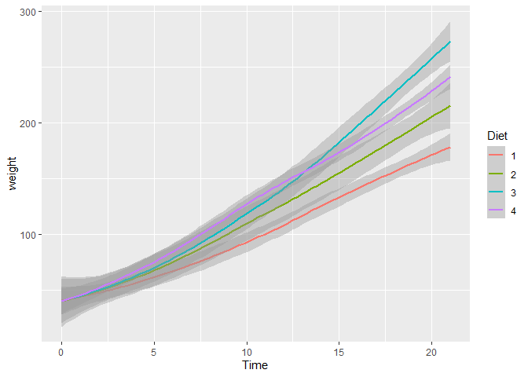
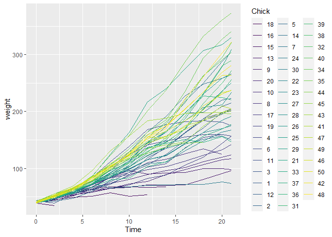
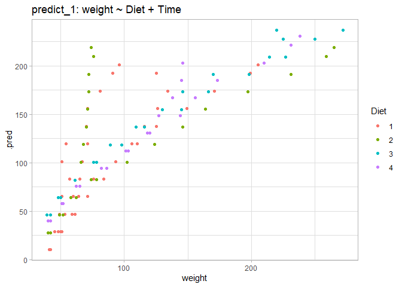
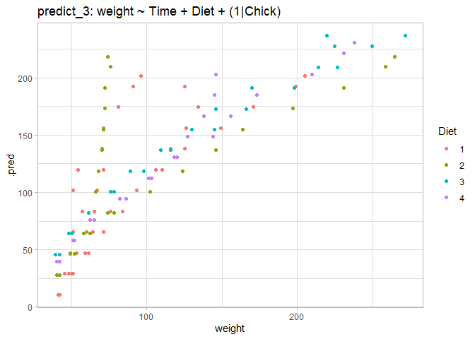
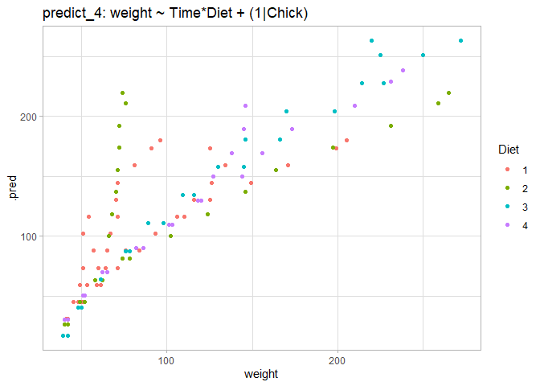
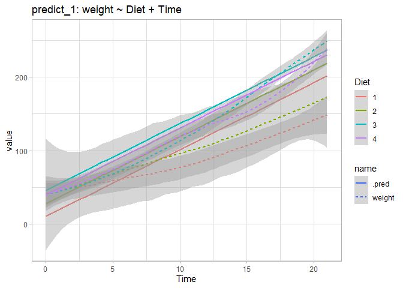
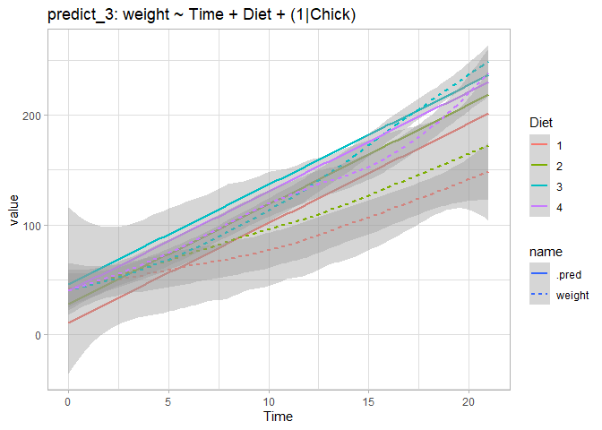
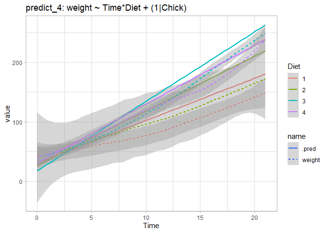
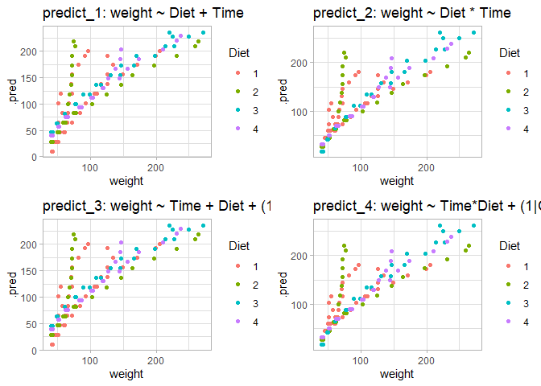
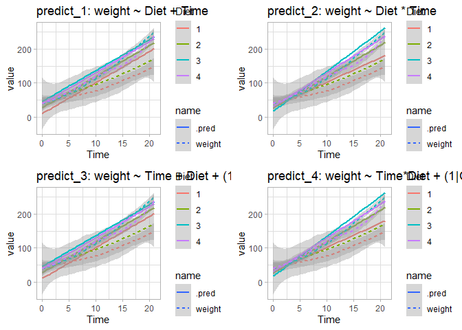

```r
library(tidymodels)
```

```
## ── Attaching packages ────────────────────────────────────── tidymodels 1.1.1 ──
```

```
## ✔ broom        1.0.5     ✔ recipes      1.0.8
## ✔ dials        1.2.0     ✔ rsample      1.2.0
## ✔ dplyr        1.1.3     ✔ tibble       3.2.1
## ✔ ggplot2      3.4.4     ✔ tidyr        1.3.0
## ✔ infer        1.0.5     ✔ tune         1.1.2
## ✔ modeldata    1.2.0     ✔ workflows    1.1.3
## ✔ parsnip      1.1.1     ✔ workflowsets 1.0.1
## ✔ purrr        1.0.2     ✔ yardstick    1.2.0
```

```
## ── Conflicts ───────────────────────────────────────── tidymodels_conflicts() ──
## ✖ purrr::discard() masks scales::discard()
## ✖ dplyr::filter()  masks stats::filter()
## ✖ dplyr::lag()     masks stats::lag()
## ✖ recipes::step()  masks stats::step()
## • Dig deeper into tidy modeling with R at https://www.tmwr.org
```

```r
library(kknn)
library(kableExtra)
```

```
## 
## Attaching package: 'kableExtra'
```

```
## The following object is masked from 'package:dplyr':
## 
##     group_rows
```

```r
library(tidyr)
library(multilevelmod)
library(gridExtra)
```

```
## 
## Attaching package: 'gridExtra'
```

```
## The following object is masked from 'package:dplyr':
## 
##     combine
```


For next week:

We will use the ChickWeight data set.  It is a built in dataset

For info


```r
?ChickWeight
```

```
## starting httpd help server ... done
```

To use it


```r
data(ChickWeight)
```

### then it is an object in your environment


```r
summary(ChickWeight)
```

```
##      weight           Time           Chick     Diet   
##  Min.   : 35.0   Min.   : 0.00   13     : 12   1:220  
##  1st Qu.: 63.0   1st Qu.: 4.00   9      : 12   2:120  
##  Median :103.0   Median :10.00   20     : 12   3:120  
##  Mean   :121.8   Mean   :10.72   10     : 12   4:118  
##  3rd Qu.:163.8   3rd Qu.:16.00   17     : 12          
##  Max.   :373.0   Max.   :21.00   19     : 12          
##                                  (Other):506
```

### Or if you have skimr installed


```r
skimr::skim(ChickWeight) #nicer summary
```


<table style='width: auto;'
      class='table table-condensed'>
<caption>Data summary</caption>
<tbody>
  <tr>
   <td style="text-align:left;"> Name </td>
   <td style="text-align:left;"> ChickWeight </td>
  </tr>
  <tr>
   <td style="text-align:left;"> Number of rows </td>
   <td style="text-align:left;"> 578 </td>
  </tr>
  <tr>
   <td style="text-align:left;"> Number of columns </td>
   <td style="text-align:left;"> 4 </td>
  </tr>
  <tr>
   <td style="text-align:left;"> _______________________ </td>
   <td style="text-align:left;">  </td>
  </tr>
  <tr>
   <td style="text-align:left;"> Column type frequency: </td>
   <td style="text-align:left;">  </td>
  </tr>
  <tr>
   <td style="text-align:left;"> factor </td>
   <td style="text-align:left;"> 2 </td>
  </tr>
  <tr>
   <td style="text-align:left;"> numeric </td>
   <td style="text-align:left;"> 2 </td>
  </tr>
  <tr>
   <td style="text-align:left;"> ________________________ </td>
   <td style="text-align:left;">  </td>
  </tr>
  <tr>
   <td style="text-align:left;"> Group variables </td>
   <td style="text-align:left;"> None </td>
  </tr>
</tbody>
</table>


**Variable type: factor**

<table>
 <thead>
  <tr>
   <th style="text-align:left;"> skim_variable </th>
   <th style="text-align:right;"> n_missing </th>
   <th style="text-align:right;"> complete_rate </th>
   <th style="text-align:left;"> ordered </th>
   <th style="text-align:right;"> n_unique </th>
   <th style="text-align:left;"> top_counts </th>
  </tr>
 </thead>
<tbody>
  <tr>
   <td style="text-align:left;"> Chick </td>
   <td style="text-align:right;"> 0 </td>
   <td style="text-align:right;"> 1 </td>
   <td style="text-align:left;"> TRUE </td>
   <td style="text-align:right;"> 50 </td>
   <td style="text-align:left;"> 13: 12, 9: 12, 20: 12, 10: 12 </td>
  </tr>
  <tr>
   <td style="text-align:left;"> Diet </td>
   <td style="text-align:right;"> 0 </td>
   <td style="text-align:right;"> 1 </td>
   <td style="text-align:left;"> FALSE </td>
   <td style="text-align:right;"> 4 </td>
   <td style="text-align:left;"> 1: 220, 2: 120, 3: 120, 4: 118 </td>
  </tr>
</tbody>
</table>


**Variable type: numeric**

<table>
 <thead>
  <tr>
   <th style="text-align:left;"> skim_variable </th>
   <th style="text-align:right;"> n_missing </th>
   <th style="text-align:right;"> complete_rate </th>
   <th style="text-align:right;"> mean </th>
   <th style="text-align:right;"> sd </th>
   <th style="text-align:right;"> p0 </th>
   <th style="text-align:right;"> p25 </th>
   <th style="text-align:right;"> p50 </th>
   <th style="text-align:right;"> p75 </th>
   <th style="text-align:right;"> p100 </th>
   <th style="text-align:left;"> hist </th>
  </tr>
 </thead>
<tbody>
  <tr>
   <td style="text-align:left;"> weight </td>
   <td style="text-align:right;"> 0 </td>
   <td style="text-align:right;"> 1 </td>
   <td style="text-align:right;"> 121.82 </td>
   <td style="text-align:right;"> 71.07 </td>
   <td style="text-align:right;"> 35 </td>
   <td style="text-align:right;"> 63 </td>
   <td style="text-align:right;"> 103 </td>
   <td style="text-align:right;"> 163.75 </td>
   <td style="text-align:right;"> 373 </td>
   <td style="text-align:left;"> ▇▅▂▁▁ </td>
  </tr>
  <tr>
   <td style="text-align:left;"> Time </td>
   <td style="text-align:right;"> 0 </td>
   <td style="text-align:right;"> 1 </td>
   <td style="text-align:right;"> 10.72 </td>
   <td style="text-align:right;"> 6.76 </td>
   <td style="text-align:right;"> 0 </td>
   <td style="text-align:right;"> 4 </td>
   <td style="text-align:right;"> 10 </td>
   <td style="text-align:right;"> 16.00 </td>
   <td style="text-align:right;"> 21 </td>
   <td style="text-align:left;"> ▇▅▅▅▇ </td>
  </tr>
</tbody>
</table>


```r
str(ChickWeight)
```

```
## Classes 'nfnGroupedData', 'nfGroupedData', 'groupedData' and 'data.frame':	578 obs. of  4 variables:
##  $ weight: num  42 51 59 64 76 93 106 125 149 171 ...
##  $ Time  : num  0 2 4 6 8 10 12 14 16 18 ...
##  $ Chick : Ord.factor w/ 50 levels "18"<"16"<"15"<..: 15 15 15 15 15 15 15 15 15 15 ...
##  $ Diet  : Factor w/ 4 levels "1","2","3","4": 1 1 1 1 1 1 1 1 1 1 ...
##  - attr(*, "formula")=Class 'formula'  language weight ~ Time | Chick
##   .. ..- attr(*, ".Environment")=<environment: R_EmptyEnv> 
##  - attr(*, "outer")=Class 'formula'  language ~Diet
##   .. ..- attr(*, ".Environment")=<environment: R_EmptyEnv> 
##  - attr(*, "labels")=List of 2
##   ..$ x: chr "Time"
##   ..$ y: chr "Body weight"
##  - attr(*, "units")=List of 2
##   ..$ x: chr "(days)"
##   ..$ y: chr "(gm)"
```


# 1. use `rsample` to create training and test sets from ChickWeight.  Think about how you want this to be split.  hint:: you may need to also use a function from Chapter 3.  message me if you are stuck.


```r
# Create a simple random sample of Chick indices
set.seed(123)
chick_indices <- group_initial_split(ChickWeight, group = Chick, prop = 0.8, strata = Diet)
chick_indices
```

```
## <Training/Testing/Total>
## <466/112/578>
```


```r
# Extract the training and test sets
chick_train <- training(chick_indices)
chick_test <- testing(chick_indices)

str(chick_train)
```

```
## Classes 'nfnGroupedData', 'nfGroupedData', 'groupedData' and 'data.frame':	466 obs. of  4 variables:
##  $ weight: num  40 49 58 72 84 103 122 138 162 187 ...
##  $ Time  : num  0 2 4 6 8 10 12 14 16 18 ...
##  $ Chick : Ord.factor w/ 50 levels "18"<"16"<"15"<..: 17 17 17 17 17 17 17 17 17 17 ...
##  $ Diet  : Factor w/ 4 levels "1","2","3","4": 1 1 1 1 1 1 1 1 1 1 ...
##  - attr(*, "formula")=Class 'formula'  language weight ~ Time | Chick
##   .. ..- attr(*, ".Environment")=<environment: R_EmptyEnv> 
##  - attr(*, "outer")=Class 'formula'  language ~Diet
##   .. ..- attr(*, ".Environment")=<environment: R_EmptyEnv> 
##  - attr(*, "labels")=List of 2
##   ..$ x: chr "Time"
##   ..$ y: chr "Body weight"
##  - attr(*, "units")=List of 2
##   ..$ x: chr "(days)"
##   ..$ y: chr "(gm)"
```

```r
str(chick_test)
```

```
## Classes 'nfnGroupedData', 'nfGroupedData', 'groupedData' and 'data.frame':	112 obs. of  4 variables:
##  $ weight: num  42 51 59 64 76 93 106 125 149 171 ...
##  $ Time  : num  0 2 4 6 8 10 12 14 16 18 ...
##  $ Chick : Ord.factor w/ 50 levels "18"<"16"<"15"<..: 15 15 15 15 15 15 15 15 15 15 ...
##  $ Diet  : Factor w/ 4 levels "1","2","3","4": 1 1 1 1 1 1 1 1 1 1 ...
##  - attr(*, "formula")=Class 'formula'  language weight ~ Time | Chick
##   .. ..- attr(*, ".Environment")=<environment: R_EmptyEnv> 
##  - attr(*, "outer")=Class 'formula'  language ~Diet
##   .. ..- attr(*, ".Environment")=<environment: R_EmptyEnv> 
##  - attr(*, "labels")=List of 2
##   ..$ x: chr "Time"
##   ..$ y: chr "Body weight"
##  - attr(*, "units")=List of 2
##   ..$ x: chr "(days)"
##   ..$ y: chr "(gm)"
```


```r
skimr::skim(chick_train)
```


<table style='width: auto;'
      class='table table-condensed'>
<caption>Data summary</caption>
<tbody>
  <tr>
   <td style="text-align:left;"> Name </td>
   <td style="text-align:left;"> chick_train </td>
  </tr>
  <tr>
   <td style="text-align:left;"> Number of rows </td>
   <td style="text-align:left;"> 466 </td>
  </tr>
  <tr>
   <td style="text-align:left;"> Number of columns </td>
   <td style="text-align:left;"> 4 </td>
  </tr>
  <tr>
   <td style="text-align:left;"> _______________________ </td>
   <td style="text-align:left;">  </td>
  </tr>
  <tr>
   <td style="text-align:left;"> Column type frequency: </td>
   <td style="text-align:left;">  </td>
  </tr>
  <tr>
   <td style="text-align:left;"> factor </td>
   <td style="text-align:left;"> 2 </td>
  </tr>
  <tr>
   <td style="text-align:left;"> numeric </td>
   <td style="text-align:left;"> 2 </td>
  </tr>
  <tr>
   <td style="text-align:left;"> ________________________ </td>
   <td style="text-align:left;">  </td>
  </tr>
  <tr>
   <td style="text-align:left;"> Group variables </td>
   <td style="text-align:left;"> None </td>
  </tr>
</tbody>
</table>


**Variable type: factor**

<table>
 <thead>
  <tr>
   <th style="text-align:left;"> skim_variable </th>
   <th style="text-align:right;"> n_missing </th>
   <th style="text-align:right;"> complete_rate </th>
   <th style="text-align:left;"> ordered </th>
   <th style="text-align:right;"> n_unique </th>
   <th style="text-align:left;"> top_counts </th>
  </tr>
 </thead>
<tbody>
  <tr>
   <td style="text-align:left;"> Chick </td>
   <td style="text-align:right;"> 0 </td>
   <td style="text-align:right;"> 1 </td>
   <td style="text-align:left;"> TRUE </td>
   <td style="text-align:right;"> 40 </td>
   <td style="text-align:left;"> 9: 12, 20: 12, 10: 12, 17: 12 </td>
  </tr>
  <tr>
   <td style="text-align:left;"> Diet </td>
   <td style="text-align:right;"> 0 </td>
   <td style="text-align:right;"> 1 </td>
   <td style="text-align:left;"> FALSE </td>
   <td style="text-align:right;"> 4 </td>
   <td style="text-align:left;"> 1: 178, 2: 96, 3: 96, 4: 96 </td>
  </tr>
</tbody>
</table>


**Variable type: numeric**

<table>
 <thead>
  <tr>
   <th style="text-align:left;"> skim_variable </th>
   <th style="text-align:right;"> n_missing </th>
   <th style="text-align:right;"> complete_rate </th>
   <th style="text-align:right;"> mean </th>
   <th style="text-align:right;"> sd </th>
   <th style="text-align:right;"> p0 </th>
   <th style="text-align:right;"> p25 </th>
   <th style="text-align:right;"> p50 </th>
   <th style="text-align:right;"> p75 </th>
   <th style="text-align:right;"> p100 </th>
   <th style="text-align:left;"> hist </th>
  </tr>
 </thead>
<tbody>
  <tr>
   <td style="text-align:left;"> weight </td>
   <td style="text-align:right;"> 0 </td>
   <td style="text-align:right;"> 1 </td>
   <td style="text-align:right;"> 125.59 </td>
   <td style="text-align:right;"> 72.74 </td>
   <td style="text-align:right;"> 35 </td>
   <td style="text-align:right;"> 64 </td>
   <td style="text-align:right;"> 108 </td>
   <td style="text-align:right;"> 168 </td>
   <td style="text-align:right;"> 373 </td>
   <td style="text-align:left;"> ▇▅▃▁▁ </td>
  </tr>
  <tr>
   <td style="text-align:left;"> Time </td>
   <td style="text-align:right;"> 0 </td>
   <td style="text-align:right;"> 1 </td>
   <td style="text-align:right;"> 10.81 </td>
   <td style="text-align:right;"> 6.79 </td>
   <td style="text-align:right;"> 0 </td>
   <td style="text-align:right;"> 4 </td>
   <td style="text-align:right;"> 10 </td>
   <td style="text-align:right;"> 16 </td>
   <td style="text-align:right;"> 21 </td>
   <td style="text-align:left;"> ▇▅▅▅▇ </td>
  </tr>
</tbody>
</table>


```r
skimr::skim(chick_test)
```


<table style='width: auto;'
      class='table table-condensed'>
<caption>Data summary</caption>
<tbody>
  <tr>
   <td style="text-align:left;"> Name </td>
   <td style="text-align:left;"> chick_test </td>
  </tr>
  <tr>
   <td style="text-align:left;"> Number of rows </td>
   <td style="text-align:left;"> 112 </td>
  </tr>
  <tr>
   <td style="text-align:left;"> Number of columns </td>
   <td style="text-align:left;"> 4 </td>
  </tr>
  <tr>
   <td style="text-align:left;"> _______________________ </td>
   <td style="text-align:left;">  </td>
  </tr>
  <tr>
   <td style="text-align:left;"> Column type frequency: </td>
   <td style="text-align:left;">  </td>
  </tr>
  <tr>
   <td style="text-align:left;"> factor </td>
   <td style="text-align:left;"> 2 </td>
  </tr>
  <tr>
   <td style="text-align:left;"> numeric </td>
   <td style="text-align:left;"> 2 </td>
  </tr>
  <tr>
   <td style="text-align:left;"> ________________________ </td>
   <td style="text-align:left;">  </td>
  </tr>
  <tr>
   <td style="text-align:left;"> Group variables </td>
   <td style="text-align:left;"> None </td>
  </tr>
</tbody>
</table>


**Variable type: factor**

<table>
 <thead>
  <tr>
   <th style="text-align:left;"> skim_variable </th>
   <th style="text-align:right;"> n_missing </th>
   <th style="text-align:right;"> complete_rate </th>
   <th style="text-align:left;"> ordered </th>
   <th style="text-align:right;"> n_unique </th>
   <th style="text-align:left;"> top_counts </th>
  </tr>
 </thead>
<tbody>
  <tr>
   <td style="text-align:left;"> Chick </td>
   <td style="text-align:right;"> 0 </td>
   <td style="text-align:right;"> 1 </td>
   <td style="text-align:left;"> TRUE </td>
   <td style="text-align:right;"> 10 </td>
   <td style="text-align:left;"> 13: 12, 1: 12, 24: 12, 25: 12 </td>
  </tr>
  <tr>
   <td style="text-align:left;"> Diet </td>
   <td style="text-align:right;"> 0 </td>
   <td style="text-align:right;"> 1 </td>
   <td style="text-align:left;"> FALSE </td>
   <td style="text-align:right;"> 4 </td>
   <td style="text-align:left;"> 1: 42, 2: 24, 3: 24, 4: 22 </td>
  </tr>
</tbody>
</table>


**Variable type: numeric**

<table>
 <thead>
  <tr>
   <th style="text-align:left;"> skim_variable </th>
   <th style="text-align:right;"> n_missing </th>
   <th style="text-align:right;"> complete_rate </th>
   <th style="text-align:right;"> mean </th>
   <th style="text-align:right;"> sd </th>
   <th style="text-align:right;"> p0 </th>
   <th style="text-align:right;"> p25 </th>
   <th style="text-align:right;"> p50 </th>
   <th style="text-align:right;"> p75 </th>
   <th style="text-align:right;"> p100 </th>
   <th style="text-align:left;"> hist </th>
  </tr>
 </thead>
<tbody>
  <tr>
   <td style="text-align:left;"> weight </td>
   <td style="text-align:right;"> 0 </td>
   <td style="text-align:right;"> 1 </td>
   <td style="text-align:right;"> 106.12 </td>
   <td style="text-align:right;"> 61.52 </td>
   <td style="text-align:right;"> 39 </td>
   <td style="text-align:right;"> 59.75 </td>
   <td style="text-align:right;"> 81.5 </td>
   <td style="text-align:right;"> 144.25 </td>
   <td style="text-align:right;"> 272 </td>
   <td style="text-align:left;"> ▇▃▂▁▁ </td>
  </tr>
  <tr>
   <td style="text-align:left;"> Time </td>
   <td style="text-align:right;"> 0 </td>
   <td style="text-align:right;"> 1 </td>
   <td style="text-align:right;"> 10.35 </td>
   <td style="text-align:right;"> 6.66 </td>
   <td style="text-align:right;"> 0 </td>
   <td style="text-align:right;"> 4.00 </td>
   <td style="text-align:right;"> 10.0 </td>
   <td style="text-align:right;"> 16.00 </td>
   <td style="text-align:right;"> 21 </td>
   <td style="text-align:left;"> ▇▅▅▅▆ </td>
  </tr>
</tbody>
</table>

# 2. fit an lm to the ChickWeight (training) data set, modelling weight as a function of diet and time (and their interaction?),  using parsnip tools.  This really should be a mixed-effects model, so see if you can do that instead (e.g. with lme4 or stan as the engine).

### model1: basic model without interaction


```r
lm_model <- 
  linear_reg() %>% 
  set_engine("lm")

lm_form_fit1 <- 
  lm_model %>% 
  # Recall that Sale_Price has been pre-logged
  fit(weight ~ Diet + Time, data = chick_train)

lm_form_fit1
```

```
## parsnip model object
## 
## 
## Call:
## stats::lm(formula = weight ~ Diet + Time, data = data)
## 
## Coefficients:
## (Intercept)        Diet2        Diet3        Diet4         Time  
##      10.590       17.370       35.307       29.130        9.082
```


```r
tidy(lm_form_fit1)
```

```
## # A tibble: 5 × 5
##   term        estimate std.error statistic   p.value
##   <chr>          <dbl>     <dbl>     <dbl>     <dbl>
## 1 (Intercept)    10.6      3.70       2.86 4.43e-  3
## 2 Diet2          17.4      4.49       3.87 1.26e-  4
## 3 Diet3          35.3      4.49       7.86 2.76e- 14
## 4 Diet4          29.1      4.49       6.48 2.31e- 10
## 5 Time            9.08     0.242     37.5  5.87e-142
```


```r
glance(lm_form_fit1)
```

```
## # A tibble: 1 × 12
##   r.squared adj.r.squared sigma statistic   p.value    df logLik   AIC   BIC
##       <dbl>         <dbl> <dbl>     <dbl>     <dbl> <dbl>  <dbl> <dbl> <dbl>
## 1     0.764         0.762  35.5      373. 4.26e-143     4 -2322. 4656. 4680.
## # ℹ 3 more variables: deviance <dbl>, df.residual <int>, nobs <int>
```


```r
lm_form_fit1 %>%
  extract_fit_engine() %>%
  summary()
```

```
## 
## Call:
## stats::lm(formula = weight ~ Diet + Time, data = data)
## 
## Residuals:
##      Min       1Q   Median       3Q      Max 
## -103.311  -18.245   -3.081   14.040  136.382 
## 
## Coefficients:
##             Estimate Std. Error t value Pr(>|t|)    
## (Intercept)  10.5896     3.7029   2.860 0.004432 ** 
## Diet2        17.3699     4.4928   3.866 0.000126 ***
## Diet3        35.3074     4.4928   7.859 2.76e-14 ***
## Diet4        29.1304     4.4928   6.484 2.31e-10 ***
## Time          9.0819     0.2425  37.459  < 2e-16 ***
## ---
## Signif. codes:  0 '***' 0.001 '**' 0.01 '*' 0.05 '.' 0.1 ' ' 1
## 
## Residual standard error: 35.48 on 461 degrees of freedom
## Multiple R-squared:  0.7642,	Adjusted R-squared:  0.7621 
## F-statistic: 373.5 on 4 and 461 DF,  p-value: < 2.2e-16
```


### model2: basic model with interaction 


```r
lm_form_fit2 <- 
  lm_model %>% 
  # Recall that Sale_Price has been pre-logged
  fit(weight ~ Diet * Time, data = chick_train)

lm_form_fit2
```

```
## parsnip model object
## 
## 
## Call:
## stats::lm(formula = weight ~ Diet * Time, data = data)
## 
## Coefficients:
## (Intercept)        Diet2        Diet3        Diet4         Time   Diet2:Time  
##    30.79714     -4.09501    -13.34556      0.07092      7.18082      2.01631  
##  Diet3:Time   Diet4:Time  
##     4.50682      2.71199
```


```r
tidy(lm_form_fit2)
```

```
## # A tibble: 8 × 5
##   term        estimate std.error statistic  p.value
##   <chr>          <dbl>     <dbl>     <dbl>    <dbl>
## 1 (Intercept)  30.8        4.68    6.57    1.34e-10
## 2 Diet2        -4.10       8.02   -0.511   6.10e- 1
## 3 Diet3       -13.3        8.02   -1.66    9.67e- 2
## 4 Diet4         0.0709     8.02    0.00885 9.93e- 1
## 5 Time          7.18       0.372  19.3     2.72e-61
## 6 Diet2:Time    2.02       0.628   3.21    1.42e- 3
## 7 Diet3:Time    4.51       0.628   7.18    2.93e-12
## 8 Diet4:Time    2.71       0.628   4.32    1.93e- 5
```


```r
glance(lm_form_fit2)
```

```
## # A tibble: 1 × 12
##   r.squared adj.r.squared sigma statistic   p.value    df logLik   AIC   BIC
##       <dbl>         <dbl> <dbl>     <dbl>     <dbl> <dbl>  <dbl> <dbl> <dbl>
## 1     0.790         0.786  33.6      245. 1.33e-150     7 -2295. 4609. 4646.
## # ℹ 3 more variables: deviance <dbl>, df.residual <int>, nobs <int>
```


```r
lm_form_fit2 %>%
  extract_fit_engine() %>%
  summary()
```

```
## 
## Call:
## stats::lm(formula = weight ~ Diet * Time, data = data)
## 
## Residuals:
##      Min       1Q   Median       3Q      Max 
## -115.892  -14.599   -1.989   11.836  123.406 
## 
## Coefficients:
##              Estimate Std. Error t value Pr(>|t|)    
## (Intercept)  30.79714    4.68491   6.574 1.34e-10 ***
## Diet2        -4.09501    8.01798  -0.511  0.60979    
## Diet3       -13.34556    8.01798  -1.664  0.09671 .  
## Diet4         0.07092    8.01798   0.009  0.99295    
## Time          7.18082    0.37156  19.326  < 2e-16 ***
## Diet2:Time    2.01631    0.62812   3.210  0.00142 ** 
## Diet3:Time    4.50682    0.62812   7.175 2.93e-12 ***
## Diet4:Time    2.71199    0.62812   4.318 1.93e-05 ***
## ---
## Signif. codes:  0 '***' 0.001 '**' 0.01 '*' 0.05 '.' 0.1 ' ' 1
## 
## Residual standard error: 33.62 on 458 degrees of freedom
## Multiple R-squared:  0.7896,	Adjusted R-squared:  0.7864 
## F-statistic: 245.5 on 7 and 458 DF,  p-value: < 2.2e-16
```


### model3: mixed-effects model with `Chick` as random effects


```r
show_engines('linear_reg')
```

```
## # A tibble: 13 × 2
##    engine     mode      
##    <chr>      <chr>     
##  1 lm         regression
##  2 glm        regression
##  3 glmnet     regression
##  4 stan       regression
##  5 spark      regression
##  6 keras      regression
##  7 brulee     regression
##  8 stan_glmer regression
##  9 lmer       regression
## 10 glmer      regression
## 11 gee        regression
## 12 lme        regression
## 13 gls        regression
```


```r
lmer_spec <- 
  linear_reg() %>% 
  set_engine("lmer")

lmer_fit <- 
  lmer_spec %>% 
  fit(weight ~ Time + Diet + (1|Chick), data = chick_train)

lmer_fit
```

```
## parsnip model object
## 
## Linear mixed model fit by REML ['lmerMod']
## Formula: weight ~ Time + Diet + (1 | Chick)
##    Data: data
## REML criterion at convergence: 4485.053
## Random effects:
##  Groups   Name        Std.Dev.
##  Chick    (Intercept) 22.77   
##  Residual             27.95   
## Number of obs: 466, groups:  Chick, 40
## Fixed Effects:
## (Intercept)         Time        Diet2        Diet3        Diet4  
##      10.948        9.074       17.099       35.037       28.860
```


```r
lmer_fit %>%
  extract_fit_engine() %>%
  summary()
```

```
## Linear mixed model fit by REML ['lmerMod']
## Formula: weight ~ Time + Diet + (1 | Chick)
##    Data: data
## 
## REML criterion at convergence: 4485.1
## 
## Scaled residuals: 
##     Min      1Q  Median      3Q     Max 
## -2.7864 -0.6189 -0.0728  0.5060  3.3526 
## 
## Random effects:
##  Groups   Name        Variance Std.Dev.
##  Chick    (Intercept) 518.6    22.77   
##  Residual             781.2    27.95   
## Number of obs: 466, groups:  Chick, 40
## 
## Fixed effects:
##             Estimate Std. Error t value
## (Intercept)   10.948      6.429   1.703
## Time           9.074      0.192  47.270
## Diet2         17.099     10.508   1.627
## Diet3         35.037     10.508   3.334
## Diet4         28.860     10.508   2.746
## 
## Correlation of Fixed Effects:
##       (Intr) Time   Diet2  Diet3 
## Time  -0.307                     
## Diet2 -0.551 -0.012              
## Diet3 -0.551 -0.012  0.339       
## Diet4 -0.551 -0.012  0.339  0.339
```

### model4: mixed-effects model with `Chick` as random effects


```r
lmer_spec <- 
  linear_reg() %>% 
  set_engine("lmer")

lmer_fit_i <- 
  lmer_spec %>% 
  fit(weight ~ Time*Diet + (1|Chick), data = chick_train)

lmer_fit_i
```

```
## parsnip model object
## 
## Linear mixed model fit by REML ['lmerMod']
## Formula: weight ~ Time * Diet + (1 | Chick)
##    Data: data
## REML criterion at convergence: 4393.471
## Random effects:
##  Groups   Name        Std.Dev.
##  Chick    (Intercept) 23.1    
##  Residual             25.2    
## Number of obs: 466, groups:  Chick, 40
## Fixed Effects:
## (Intercept)         Time        Diet2        Diet3        Diet4   Time:Diet2  
##     31.1323       7.1070      -4.4302     -13.6807      -0.2642       2.0901  
##  Time:Diet3   Time:Diet4  
##      4.5807       2.7858
```


```r
lmer_fit_i %>%
  extract_fit_engine() %>%
  summary()
```

```
## Linear mixed model fit by REML ['lmerMod']
## Formula: weight ~ Time * Diet + (1 | Chick)
##    Data: data
## 
## REML criterion at convergence: 4393.5
## 
## Scaled residuals: 
##     Min      1Q  Median      3Q     Max 
## -3.3247 -0.6150 -0.0782  0.5916  3.4547 
## 
## Random effects:
##  Groups   Name        Variance Std.Dev.
##  Chick    (Intercept) 533.4    23.1    
##  Residual             635.1    25.2    
## Number of obs: 466, groups:  Chick, 40
## 
## Fixed effects:
##             Estimate Std. Error t value
## (Intercept)  31.1323     6.7704   4.598
## Time          7.1070     0.2824  25.167
## Diet2        -4.4302    11.6749  -0.379
## Diet3       -13.6807    11.6749  -1.172
## Diet4        -0.2642    11.6749  -0.023
## Time:Diet2    2.0901     0.4731   4.418
## Time:Diet3    4.5807     0.4731   9.682
## Time:Diet4    2.7858     0.4731   5.888
## 
## Correlation of Fixed Effects:
##            (Intr) Time   Diet2  Diet3  Diet4  Tm:Dt2 Tm:Dt3
## Time       -0.427                                          
## Diet2      -0.580  0.248                                   
## Diet3      -0.580  0.248  0.336                            
## Diet4      -0.580  0.248  0.336  0.336                     
## Time:Diet2  0.255 -0.597 -0.433 -0.148 -0.148              
## Time:Diet3  0.255 -0.597 -0.148 -0.433 -0.148  0.356       
## Time:Diet4  0.255 -0.597 -0.148 -0.148 -0.433  0.356  0.356
```


# 3. use your model to predict weight in your test set chicks. (using parsnip tools)
plot predicted vs observed in your test data set.

### original data


```r
ChickWeight %>%
  ggplot(aes(x=Time, y=weight)) +
  geom_smooth(aes(colour=Diet))
```

```
## `geom_smooth()` using method = 'loess' and formula = 'y ~ x'
```

<!-- -->


```r
ChickWeight %>%
  ggplot(aes(x=Time, y=weight)) +
  geom_line(aes(colour=Chick))
```

<!-- -->

### model1:


```r
predict1 <- chick_test %>% 
  select(Time, Diet, weight) %>% 
  bind_cols(predict(lm_form_fit1, chick_test))

predict1
```

```
##     Time Diet weight     .pred
## 1      0    1     42  10.58962
## 2      2    1     51  28.75352
## 3      4    1     59  46.91742
## 4      6    1     64  65.08132
## 5      8    1     76  83.24521
## 6     10    1     93 101.40911
## 7     12    1    106 119.57301
## 8     14    1    125 137.73691
## 9     16    1    149 155.90080
## 10    18    1    171 174.06470
## 11    20    1    199 192.22860
## 12    21    1    205 201.31055
## 13     0    1     42  10.58962
## 14     2    1     50  28.75352
## 15     4    1     61  46.91742
## 16     6    1     71  65.08132
## 17     8    1     84  83.24521
## 18    10    1     93 101.40911
## 19    12    1    110 119.57301
## 20    14    1    116 137.73691
## 21    16    1    126 155.90080
## 22    18    1    134 174.06470
## 23    20    1    125 192.22860
## 24     0    1     41  10.58962
## 25     2    1     48  28.75352
## 26     4    1     53  46.91742
## 27     6    1     60  65.08132
## 28     8    1     65  83.24521
## 29    10    1     67 101.40911
## 30    12    1     71 119.57301
## 31    14    1     70 137.73691
## 32    16    1     71 155.90080
## 33    18    1     81 174.06470
## 34    20    1     91 192.22860
## 35    21    1     96 201.31055
## 36     0    1     41  10.58962
## 37     2    1     45  28.75352
## 38     4    1     49  46.91742
## 39     6    1     51  65.08132
## 40     8    1     57  83.24521
## 41    10    1     51 101.40911
## 42    12    1     54 119.57301
## 43     0    2     42  27.95956
## 44     2    2     52  46.12346
## 45     4    2     58  64.28735
## 46     6    2     74  82.45125
## 47     8    2     66 100.61515
## 48    10    2     68 118.77905
## 49    12    2     70 136.94294
## 50    14    2     71 155.10684
## 51    16    2     72 173.27074
## 52    18    2     72 191.43464
## 53    20    2     76 209.59854
## 54    21    2     74 218.68049
## 55     0    2     40  27.95956
## 56     2    2     49  46.12346
## 57     4    2     62  64.28735
## 58     6    2     78  82.45125
## 59     8    2    102 100.61515
## 60    10    2    124 118.77905
## 61    12    2    146 136.94294
## 62    14    2    164 155.10684
## 63    16    2    197 173.27074
## 64    18    2    231 191.43464
## 65    20    2    259 209.59854
## 66    21    2    265 218.68049
## 67     0    3     39  45.89706
## 68     2    3     48  64.06096
## 69     4    3     61  82.22485
## 70     6    3     76 100.38875
## 71     8    3     98 118.55265
## 72    10    3    116 136.71655
## 73    12    3    145 154.88044
## 74    14    3    166 173.04434
## 75    16    3    198 191.20824
## 76    18    3    227 209.37214
## 77    20    3    225 227.53604
## 78    21    3    220 236.61799
## 79     0    3     42  45.89706
## 80     2    3     50  64.06096
## 81     4    3     61  82.22485
## 82     6    3     78 100.38875
## 83     8    3     89 118.55265
## 84    10    3    109 136.71655
## 85    12    3    130 154.88044
## 86    14    3    146 173.04434
## 87    16    3    170 191.20824
## 88    18    3    214 209.37214
## 89    20    3    250 227.53604
## 90    21    3    272 236.61799
## 91     0    4     42  39.71997
## 92     2    4     51  57.88387
## 93     4    4     65  76.04777
## 94     6    4     86  94.21167
## 95     8    4    103 112.37557
## 96    10    4    118 130.53946
## 97    12    4    127 148.70336
## 98    14    4    138 166.86726
## 99    16    4    145 185.03116
## 100   18    4    146 203.19505
## 101    0    4     40  39.71997
## 102    2    4     52  57.88387
## 103    4    4     62  76.04777
## 104    6    4     82  94.21167
## 105    8    4    101 112.37557
## 106   10    4    120 130.53946
## 107   12    4    144 148.70336
## 108   14    4    156 166.86726
## 109   16    4    173 185.03116
## 110   18    4    210 203.19505
## 111   20    4    231 221.35895
## 112   21    4    238 230.44090
```


```r
plot1 <- predict1 |> 
  ggplot(aes(x=weight, y=.pred, color=Diet)) +
  geom_point() +
  theme_light() +
  labs(title = "predict_1: weight ~ Diet + Time")

plot1
```

<!-- -->

### model2:


```r
predict2 <- chick_test %>% 
  select(Time, Diet, weight) %>% 
  bind_cols(predict(lm_form_fit2, chick_test))

predict2
```

```
##     Time Diet weight     .pred
## 1      0    1     42  30.79714
## 2      2    1     51  45.15878
## 3      4    1     59  59.52041
## 4      6    1     64  73.88205
## 5      8    1     76  88.24369
## 6     10    1     93 102.60533
## 7     12    1    106 116.96697
## 8     14    1    125 131.32860
## 9     16    1    149 145.69024
## 10    18    1    171 160.05188
## 11    20    1    199 174.41352
## 12    21    1    205 181.59434
## 13     0    1     42  30.79714
## 14     2    1     50  45.15878
## 15     4    1     61  59.52041
## 16     6    1     71  73.88205
## 17     8    1     84  88.24369
## 18    10    1     93 102.60533
## 19    12    1    110 116.96697
## 20    14    1    116 131.32860
## 21    16    1    126 145.69024
## 22    18    1    134 160.05188
## 23    20    1    125 174.41352
## 24     0    1     41  30.79714
## 25     2    1     48  45.15878
## 26     4    1     53  59.52041
## 27     6    1     60  73.88205
## 28     8    1     65  88.24369
## 29    10    1     67 102.60533
## 30    12    1     71 116.96697
## 31    14    1     70 131.32860
## 32    16    1     71 145.69024
## 33    18    1     81 160.05188
## 34    20    1     91 174.41352
## 35    21    1     96 181.59434
## 36     0    1     41  30.79714
## 37     2    1     45  45.15878
## 38     4    1     49  59.52041
## 39     6    1     51  73.88205
## 40     8    1     57  88.24369
## 41    10    1     51 102.60533
## 42    12    1     54 116.96697
## 43     0    2     42  26.70213
## 44     2    2     52  45.09639
## 45     4    2     58  63.49066
## 46     6    2     74  81.88493
## 47     8    2     66 100.27919
## 48    10    2     68 118.67346
## 49    12    2     70 137.06773
## 50    14    2     71 155.46200
## 51    16    2     72 173.85626
## 52    18    2     72 192.25053
## 53    20    2     76 210.64480
## 54    21    2     74 219.84193
## 55     0    2     40  26.70213
## 56     2    2     49  45.09639
## 57     4    2     62  63.49066
## 58     6    2     78  81.88493
## 59     8    2    102 100.27919
## 60    10    2    124 118.67346
## 61    12    2    146 137.06773
## 62    14    2    164 155.46200
## 63    16    2    197 173.85626
## 64    18    2    231 192.25053
## 65    20    2    259 210.64480
## 66    21    2    265 219.84193
## 67     0    3     39  17.45158
## 68     2    3     48  40.82686
## 69     4    3     61  64.20214
## 70     6    3     76  87.57743
## 71     8    3     98 110.95271
## 72    10    3    116 134.32800
## 73    12    3    145 157.70328
## 74    14    3    166 181.07856
## 75    16    3    198 204.45385
## 76    18    3    227 227.82913
## 77    20    3    225 251.20441
## 78    21    3    220 262.89205
## 79     0    3     42  17.45158
## 80     2    3     50  40.82686
## 81     4    3     61  64.20214
## 82     6    3     78  87.57743
## 83     8    3     89 110.95271
## 84    10    3    109 134.32800
## 85    12    3    130 157.70328
## 86    14    3    146 181.07856
## 87    16    3    170 204.45385
## 88    18    3    214 227.82913
## 89    20    3    250 251.20441
## 90    21    3    272 262.89205
## 91     0    4     42  30.86806
## 92     2    4     51  50.65368
## 93     4    4     65  70.43931
## 94     6    4     86  90.22493
## 95     8    4    103 110.01055
## 96    10    4    118 129.79617
## 97    12    4    127 149.58180
## 98    14    4    138 169.36742
## 99    16    4    145 189.15304
## 100   18    4    146 208.93866
## 101    0    4     40  30.86806
## 102    2    4     52  50.65368
## 103    4    4     62  70.43931
## 104    6    4     82  90.22493
## 105    8    4    101 110.01055
## 106   10    4    120 129.79617
## 107   12    4    144 149.58180
## 108   14    4    156 169.36742
## 109   16    4    173 189.15304
## 110   18    4    210 208.93866
## 111   20    4    231 228.72429
## 112   21    4    238 238.61710
```


```r
plot2 <- predict2 |> 
  ggplot(aes(x=weight, y=.pred, color=Diet)) +
  geom_point() +
  theme_light() +
  labs(title = "predict_2: weight ~ Diet * Time")

plot2
```

<!-- -->

### model2:


```r
predict3 <- chick_test %>% 
  select(Time, Diet, weight) %>% 
  bind_cols(predict(lmer_fit, chick_test))

predict3
```

```
##     Time Diet weight     .pred
## 1      0    1     42  10.94794
## 2      2    1     51  29.09577
## 3      4    1     59  47.24359
## 4      6    1     64  65.39141
## 5      8    1     76  83.53923
## 6     10    1     93 101.68705
## 7     12    1    106 119.83487
## 8     14    1    125 137.98269
## 9     16    1    149 156.13051
## 10    18    1    171 174.27834
## 11    20    1    199 192.42616
## 12    21    1    205 201.50007
## 13     0    1     42  10.94794
## 14     2    1     50  29.09577
## 15     4    1     61  47.24359
## 16     6    1     71  65.39141
## 17     8    1     84  83.53923
## 18    10    1     93 101.68705
## 19    12    1    110 119.83487
## 20    14    1    116 137.98269
## 21    16    1    126 156.13051
## 22    18    1    134 174.27834
## 23    20    1    125 192.42616
## 24     0    1     41  10.94794
## 25     2    1     48  29.09577
## 26     4    1     53  47.24359
## 27     6    1     60  65.39141
## 28     8    1     65  83.53923
## 29    10    1     67 101.68705
## 30    12    1     71 119.83487
## 31    14    1     70 137.98269
## 32    16    1     71 156.13051
## 33    18    1     81 174.27834
## 34    20    1     91 192.42616
## 35    21    1     96 201.50007
## 36     0    1     41  10.94794
## 37     2    1     45  29.09577
## 38     4    1     49  47.24359
## 39     6    1     51  65.39141
## 40     8    1     57  83.53923
## 41    10    1     51 101.68705
## 42    12    1     54 119.83487
## 43     0    2     42  28.04731
## 44     2    2     52  46.19513
## 45     4    2     58  64.34295
## 46     6    2     74  82.49077
## 47     8    2     66 100.63859
## 48    10    2     68 118.78642
## 49    12    2     70 136.93424
## 50    14    2     71 155.08206
## 51    16    2     72 173.22988
## 52    18    2     72 191.37770
## 53    20    2     76 209.52552
## 54    21    2     74 218.59943
## 55     0    2     40  28.04731
## 56     2    2     49  46.19513
## 57     4    2     62  64.34295
## 58     6    2     78  82.49077
## 59     8    2    102 100.63859
## 60    10    2    124 118.78642
## 61    12    2    146 136.93424
## 62    14    2    164 155.08206
## 63    16    2    197 173.22988
## 64    18    2    231 191.37770
## 65    20    2    259 209.52552
## 66    21    2    265 218.59943
## 67     0    3     39  45.98481
## 68     2    3     48  64.13263
## 69     4    3     61  82.28045
## 70     6    3     76 100.42827
## 71     8    3     98 118.57609
## 72    10    3    116 136.72392
## 73    12    3    145 154.87174
## 74    14    3    166 173.01956
## 75    16    3    198 191.16738
## 76    18    3    227 209.31520
## 77    20    3    225 227.46302
## 78    21    3    220 236.53693
## 79     0    3     42  45.98481
## 80     2    3     50  64.13263
## 81     4    3     61  82.28045
## 82     6    3     78 100.42827
## 83     8    3     89 118.57609
## 84    10    3    109 136.72392
## 85    12    3    130 154.87174
## 86    14    3    146 173.01956
## 87    16    3    170 191.16738
## 88    18    3    214 209.31520
## 89    20    3    250 227.46302
## 90    21    3    272 236.53693
## 91     0    4     42  39.80773
## 92     2    4     51  57.95555
## 93     4    4     65  76.10337
## 94     6    4     86  94.25119
## 95     8    4    103 112.39901
## 96    10    4    118 130.54683
## 97    12    4    127 148.69465
## 98    14    4    138 166.84247
## 99    16    4    145 184.99030
## 100   18    4    146 203.13812
## 101    0    4     40  39.80773
## 102    2    4     52  57.95555
## 103    4    4     62  76.10337
## 104    6    4     82  94.25119
## 105    8    4    101 112.39901
## 106   10    4    120 130.54683
## 107   12    4    144 148.69465
## 108   14    4    156 166.84247
## 109   16    4    173 184.99030
## 110   18    4    210 203.13812
## 111   20    4    231 221.28594
## 112   21    4    238 230.35985
```


```r
plot3 <- predict3 |> 
  ggplot(aes(x=weight, y=.pred, color=Diet)) +
  geom_point() +
  theme_light() +
  labs(title = "predict_3: weight ~ Time + Diet + (1|Chick)")

plot3
```

<!-- -->

### model2:


```r
predict4 <- chick_test %>% 
  select(Time, Diet, weight) %>% 
  bind_cols(predict(lmer_fit_i, chick_test))

predict4
```

```
##     Time Diet weight     .pred
## 1      0    1     42  31.13229
## 2      2    1     51  45.34626
## 3      4    1     59  59.56023
## 4      6    1     64  73.77420
## 5      8    1     76  87.98817
## 6     10    1     93 102.20214
## 7     12    1    106 116.41611
## 8     14    1    125 130.63008
## 9     16    1    149 144.84405
## 10    18    1    171 159.05802
## 11    20    1    199 173.27199
## 12    21    1    205 180.37897
## 13     0    1     42  31.13229
## 14     2    1     50  45.34626
## 15     4    1     61  59.56023
## 16     6    1     71  73.77420
## 17     8    1     84  87.98817
## 18    10    1     93 102.20214
## 19    12    1    110 116.41611
## 20    14    1    116 130.63008
## 21    16    1    126 144.84405
## 22    18    1    134 159.05802
## 23    20    1    125 173.27199
## 24     0    1     41  31.13229
## 25     2    1     48  45.34626
## 26     4    1     53  59.56023
## 27     6    1     60  73.77420
## 28     8    1     65  87.98817
## 29    10    1     67 102.20214
## 30    12    1     71 116.41611
## 31    14    1     70 130.63008
## 32    16    1     71 144.84405
## 33    18    1     81 159.05802
## 34    20    1     91 173.27199
## 35    21    1     96 180.37897
## 36     0    1     41  31.13229
## 37     2    1     45  45.34626
## 38     4    1     49  59.56023
## 39     6    1     51  73.77420
## 40     8    1     57  87.98817
## 41    10    1     51 102.20214
## 42    12    1     54 116.41611
## 43     0    2     42  26.70213
## 44     2    2     52  45.09639
## 45     4    2     58  63.49066
## 46     6    2     74  81.88493
## 47     8    2     66 100.27919
## 48    10    2     68 118.67346
## 49    12    2     70 137.06773
## 50    14    2     71 155.46200
## 51    16    2     72 173.85626
## 52    18    2     72 192.25053
## 53    20    2     76 210.64480
## 54    21    2     74 219.84193
## 55     0    2     40  26.70213
## 56     2    2     49  45.09639
## 57     4    2     62  63.49066
## 58     6    2     78  81.88493
## 59     8    2    102 100.27919
## 60    10    2    124 118.67346
## 61    12    2    146 137.06773
## 62    14    2    164 155.46200
## 63    16    2    197 173.85626
## 64    18    2    231 192.25053
## 65    20    2    259 210.64480
## 66    21    2    265 219.84193
## 67     0    3     39  17.45158
## 68     2    3     48  40.82686
## 69     4    3     61  64.20214
## 70     6    3     76  87.57743
## 71     8    3     98 110.95271
## 72    10    3    116 134.32800
## 73    12    3    145 157.70328
## 74    14    3    166 181.07856
## 75    16    3    198 204.45385
## 76    18    3    227 227.82913
## 77    20    3    225 251.20441
## 78    21    3    220 262.89205
## 79     0    3     42  17.45158
## 80     2    3     50  40.82686
## 81     4    3     61  64.20214
## 82     6    3     78  87.57743
## 83     8    3     89 110.95271
## 84    10    3    109 134.32800
## 85    12    3    130 157.70328
## 86    14    3    146 181.07856
## 87    16    3    170 204.45385
## 88    18    3    214 227.82913
## 89    20    3    250 251.20441
## 90    21    3    272 262.89205
## 91     0    4     42  30.86806
## 92     2    4     51  50.65368
## 93     4    4     65  70.43931
## 94     6    4     86  90.22493
## 95     8    4    103 110.01055
## 96    10    4    118 129.79617
## 97    12    4    127 149.58180
## 98    14    4    138 169.36742
## 99    16    4    145 189.15304
## 100   18    4    146 208.93866
## 101    0    4     40  30.86806
## 102    2    4     52  50.65368
## 103    4    4     62  70.43931
## 104    6    4     82  90.22493
## 105    8    4    101 110.01055
## 106   10    4    120 129.79617
## 107   12    4    144 149.58180
## 108   14    4    156 169.36742
## 109   16    4    173 189.15304
## 110   18    4    210 208.93866
## 111   20    4    231 228.72429
## 112   21    4    238 238.61710
```


```r
plot4 <- predict4 |> 
  ggplot(aes(x=weight, y=.pred, color=Diet)) +
  geom_point() +
  theme_light() +
  labs(title = "predict_4: weight ~ Time*Diet + (1|Chick)")

plot4
```

<!-- -->


### model1


```r
predict1_l <- predict1 |> 
  pivot_longer(cols=c(weight, .pred))
predict1_l
```

```
## # A tibble: 224 × 4
##     Time Diet  name   value
##    <dbl> <fct> <chr>  <dbl>
##  1     0 1     weight  42  
##  2     0 1     .pred   10.6
##  3     2 1     weight  51  
##  4     2 1     .pred   28.8
##  5     4 1     weight  59  
##  6     4 1     .pred   46.9
##  7     6 1     weight  64  
##  8     6 1     .pred   65.1
##  9     8 1     weight  76  
## 10     8 1     .pred   83.2
## # ℹ 214 more rows
```


```r
predict_plot_1 <- predict1_l |> 
  ggplot(aes(x=Time, y=value, color=Diet, lty=name)) +
  geom_smooth() +
  theme_light() +
  labs(title = "predict_1: weight ~ Diet + Time")
predict_plot_1
```

```
## `geom_smooth()` using method = 'loess' and formula = 'y ~ x'
```

<!-- -->

### model2


```r
predict2_l <- predict2 |> 
  pivot_longer(cols=c(weight, .pred))
predict2_l
```

```
## # A tibble: 224 × 4
##     Time Diet  name   value
##    <dbl> <fct> <chr>  <dbl>
##  1     0 1     weight  42  
##  2     0 1     .pred   30.8
##  3     2 1     weight  51  
##  4     2 1     .pred   45.2
##  5     4 1     weight  59  
##  6     4 1     .pred   59.5
##  7     6 1     weight  64  
##  8     6 1     .pred   73.9
##  9     8 1     weight  76  
## 10     8 1     .pred   88.2
## # ℹ 214 more rows
```


```r
predict_plot_2 <- predict2_l |> 
  ggplot(aes(x=Time, y=value, color=Diet, lty=name)) +
  geom_smooth() +
  theme_light() +
  labs(title = "predict_2: weight ~ Diet * Time")
predict_plot_2
```

```
## `geom_smooth()` using method = 'loess' and formula = 'y ~ x'
```

<!-- -->


### model3


```r
predict3_l <- predict3 |> 
  pivot_longer(cols=c(weight, .pred))
predict3_l
```

```
## # A tibble: 224 × 4
##     Time Diet  name   value
##    <dbl> <fct> <chr>  <dbl>
##  1     0 1     weight  42  
##  2     0 1     .pred   10.9
##  3     2 1     weight  51  
##  4     2 1     .pred   29.1
##  5     4 1     weight  59  
##  6     4 1     .pred   47.2
##  7     6 1     weight  64  
##  8     6 1     .pred   65.4
##  9     8 1     weight  76  
## 10     8 1     .pred   83.5
## # ℹ 214 more rows
```


```r
predict_plot_3 <- predict3_l |> 
  ggplot(aes(x=Time, y=value, color=Diet, lty=name)) +
  geom_smooth() +
  theme_light() +
  labs(title = "predict_3: weight ~ Time + Diet + (1|Chick)")
predict_plot_3
```

```
## `geom_smooth()` using method = 'loess' and formula = 'y ~ x'
```

<!-- -->


### model4


```r
predict4_l <- predict4 |> 
  pivot_longer(cols=c(weight, .pred))
predict4_l
```

```
## # A tibble: 224 × 4
##     Time Diet  name   value
##    <dbl> <fct> <chr>  <dbl>
##  1     0 1     weight  42  
##  2     0 1     .pred   31.1
##  3     2 1     weight  51  
##  4     2 1     .pred   45.3
##  5     4 1     weight  59  
##  6     4 1     .pred   59.6
##  7     6 1     weight  64  
##  8     6 1     .pred   73.8
##  9     8 1     weight  76  
## 10     8 1     .pred   88.0
## # ℹ 214 more rows
```


```r
predict_plot_4 <- predict4_l |> 
  ggplot(aes(x=Time, y=value, color=Diet, lty=name)) +
  geom_smooth() +
  theme_light() +
  labs(title = "predict_4: weight ~ Time*Diet + (1|Chick)")
predict_plot_4
```

```
## `geom_smooth()` using method = 'loess' and formula = 'y ~ x'
```

<!-- -->

### compare


```r
grid.arrange(plot1, plot2, plot3, plot4) 
```

<!-- -->


```r
grid.arrange(predict_plot_1, predict_plot_2, predict_plot_3, predict_plot_4) 
```

```
## `geom_smooth()` using method = 'loess' and formula = 'y ~ x'
## `geom_smooth()` using method = 'loess' and formula = 'y ~ x'
## `geom_smooth()` using method = 'loess' and formula = 'y ~ x'
## `geom_smooth()` using method = 'loess' and formula = 'y ~ x'
```

<!-- -->


Optional: recreate an Ames Neighborhood plot.
Tutorials are at
https://ggplot2tutor.com/tutorials/streetmaps
https://joshuamccrain.com/tutorials/maps/streets_tutorial.html
ggplot2tutor.com
Streetmaps
Get really good at ggplot2 with tutorials, educational apps, and courses
